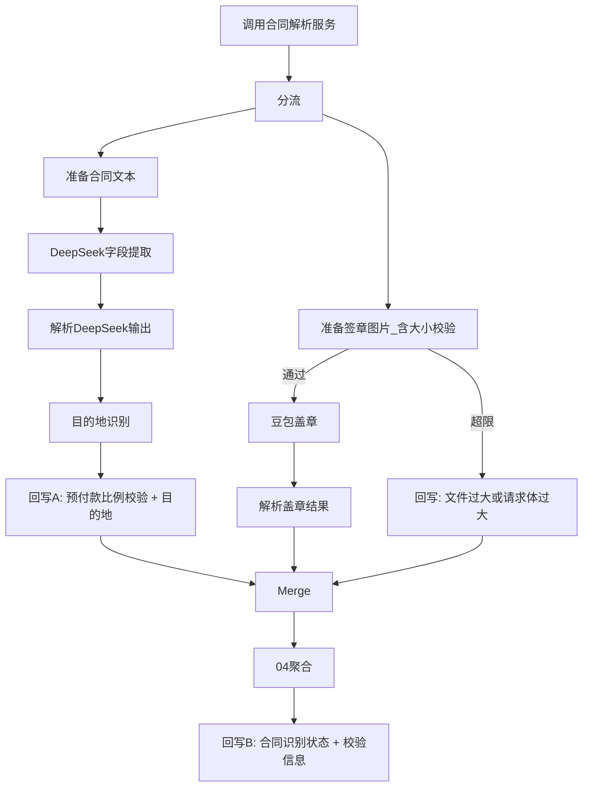

# 合同校验重新识别工作流升级 — 设计说明

**日期:** 2026-08-03  
**范围:** 仅 n8n 工作流「合同校验重新识别」（ID `7woSipOJTA1aLYL9`）  
**不含:** 「执行表合同校验」`vfdImB9mSWfRk9tl`（本次不改）

## 背景与目标

当前链路为串行：`pdf-parser` → DeepSeek 字段提取 → 豆包盖章 → 聚合 → **一次性回写**。存在：

1. PDF 10MB 闸门在 `02 检查订单合同`，过早阻断 DeepSeek；文案与代码不一致（10MB vs 30MB）。
2. 豆包 Responses API 无单图 / 请求体预检（单图 ≤10MB、请求体 ≤64MB）。
3. DeepSeek 与豆包耦合：一侧失败影响另一侧。
4. `预付款比例校验` 等 DeepSeek 结果必须等盖章结束才能回写。
5. 缺少根据活动名称识别并回写执行表【目的地】。

## 已确认决策

| 项 | 决策 |
|----|------|
| 目的地回写表/字段 | 仅执行表 `tbl821KbTBpjjyXI` · `fldZ9oTx6C`（多选） |
| 目的地识别 | 关键词优先，匹配不到再问 DeepSeek |
| 未识别目的地 | **不写**该字段（不写「其他」） |
| 改造范围 | 只改「合同校验重新识别」 |

## 架构

并行分支 + 字段级分次回写：

### 1. 大小限制前移到豆包请求构建

- 移除 `02 检查订单合同` / `Switch订单合同` 对 PDF `isnotFileTooLarge`（10MB）的硬拦，使 DeepSeek 可继续跑。
- 可选：保留更高 PDF 软上限（如 50MB）仅防下载超时，与豆包限制解耦；默认实现为去掉硬拦、可不加软上限除非实测需要。
- 在签章准备节点构建请求时：
  - 单张图片解码大小 ≤ **10MB**（由 base64 估算：`floor(len * 3 / 4)`，忽略 padding 误差可接受）
  - 完整 JSON 请求体 UTF-8 字节数 ≤ **64MB**
- 超限：**不调用**豆包；独立回写：
  - `合同识别状态` = `文件过大`
  - `校验信息` 区分：`签章图片超过10MB（…）` vs `豆包请求体超过64MB，无法调用`
- 当前仍为每请求一图；保留 body 校验以便日后扩展。

### 2. DeepSeek / 豆包隔离

- 解析完成后分出两条 main：字段支路 vs 签章支路。
- Agent / HTTP 节点启用 continueOnFail（或等价错误捕获），一侧错误不阻断另一侧。
- 最终状态组合（沿用已有单选选项）：
  - 盖章成功 + 字段失败 → `签章正确⚠️内容识别失败`
  - 字段成功 + 图片/请求体超限 → `文件过大`，校验信息注明字段侧结果
  - 字段成功 + 豆包调用失败 → 按现有盖章失败语义（识别失败 / 需人工复核等），校验信息保留字段摘要
  - 两侧都失败 → `识别失败`

### 3. 分次回写（执行表）

| 时机 | 字段 | 说明 |
|------|------|------|
| 回写 A | `预付款比例校验`、`目的地` | DeepSeek + 目的地识别完成后立即写；目的地为空则 **省略**该 key |
| 超限支路 | `合同识别状态`、`校验信息` | 可先标记过大；最终仍经 Merge 聚合 |
| 回写 B | `合同识别状态`、`校验信息` | 完整文案；body **不得**带空的预付款/目的地以免清空 A |

### 4. 目的地识别

执行表多选选项名（回写用名称数组）：

南京、安吉、千岛湖、德清、湖州市区、上海内、桐庐、舟山、临安、台州、嘉兴、杭州内、象山、宁波、无锡、苏州、溧阳、合肥、义乌、其他

（飞书存在重复「千岛湖」「象山」option id；回写用名称即可。）

规则：

1. 输入：DeepSeek 的 `活动名称`（可辅以合同前几页文本，仅作兜底 DeepSeek 上下文）。
2. 关键词：选项名按长度降序 `includes`；别名 `杭州`→`杭州内`，`上海`→`上海内`，`湖州`→`湖州市区`（已命中更长正式名时不再叠加别名误伤）。
3. 命中 ≥1 → 回写去重后的名称数组。
4. 未命中 → 短 prompt DeepSeek：仅从上述选项列表中选；过滤非法名；仍空则 **不写目的地**，可在校验信息注明「目的地未识别」。

### 5. 落地与产物

- **不写**活库 `n8n-data/database.sqlite`；由用户自行在 n8n UI 导入。
- 构建脚本：`scripts/contract_reid_upgrade_workflow.js`（基于 `workflows/_base_contract_reid.json`）。
- 可导入产物：`workflows/合同校验重新识别-升级.workflow.json`。
- 导入前停用旧「合同校验重新识别」，避免 webhook `Bill-Re-identification` 冲突。

## 错误处理与边界

- 无签章图：签章支路跳过豆包，盖章字段为不确定 / 说明「未获取签章页图片」，不阻断字段支路。
- 请求体超限与单图超限：均不调豆包，状态 `文件过大`，文案区分原因。
- Merge：两侧结果按 `record_id` 对齐；缺失一侧用默认失败/跳过语义填充后再聚合。

## 验收标准

1. 大 PDF 可解析时：DeepSeek 与预付款可回写；签章图超 10MB → `文件过大` 且文案指图片而非整份 PDF。
2. DeepSeek 失败：盖章仍可完成并回写盖章相关结果。
3. 豆包失败或超限：预付款（及已识别目的地）仍保留；回写 B 不清空它们。
4. 活动名含「安吉」→ 目的地含安吉；无关键词且 DeepSeek 也选不出 → 目的地字段不被写入。
5. 仅「合同校验重新识别」变更；「执行表合同校验」保持不动。

## 非目标

- 不改 pdf-parser 渲染缩放（除非验收发现单页 PNG 常态 >10MB，再单独立项压缩）。
- 不改 feishu-listener 路由。
- 不同步改造「执行表合同校验」。
