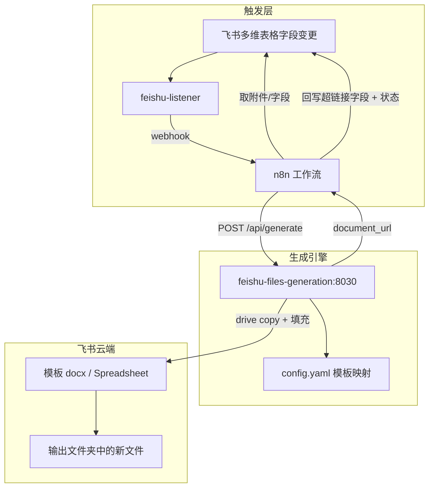
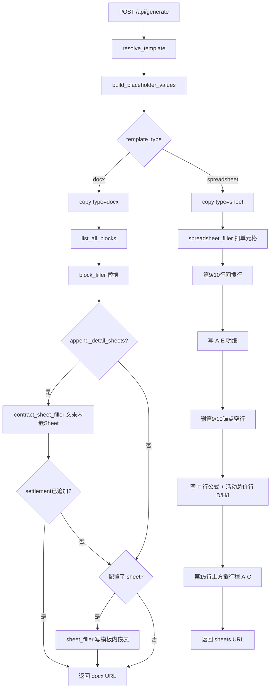

# Feishu Files Generation

飞书云文档合同 / 出团计划单 / **在线报价 Spreadsheet** 生成服务：

- **docx 路径**：复制模板 → 替换 `{{占位符}}` →（合同/出团）文末创建内嵌 Sheet（合同：费用+行程；出团：预定结算+公式）→ 返回 URL
- **spreadsheet 路径**（`type: spreadsheet`）：复制独立电子表格 → 扫描替换单元格 `{{占位符}}` → 在锚点行之间插行写入明细 → 返回 URL

供 n8n / curl 通过 Docker 内网调用。端口默认 `8030`。

上级设计文档：

- [合同生成工作流.md](../合同生成工作流.md)（路径选型）
- [合同生成-路径B实现.md](../合同生成-路径B实现.md)（实现规格）
- [出团计划单模板.md](../出团计划单模板.md)（出团计划单占位符与 Sheet 列约定）
- [ONLINE_QUOTE_TEMPLATE.md](ONLINE_QUOTE_TEMPLATE.md)（在线报价模板约定）

---

## 调用原理

飞书**没有**模板变量合并 API。本服务按官方推荐流程：

1. `drive/v1/files/{template_token}/copy` — 把模板复制到目标文件夹
2. `docx/v1/documents/{id}/blocks/{id}/children?with_descendants=true` — 拉取整棵块树
3. 在每个含 `text.elements[].text_run` 的块里，用正则替换 `{{key}}`
4. `docx/v1/documents/{id}/blocks/batch_update` — 分批写回（保留 `text_element_style`）
5. （合同，`append_detail_sheets: true`）文末创建二级标题 + `block_type=30` Sheet → `values_batch_update` 写明细 → `dimension_range` 设列宽 → `styles_batch_update` 居中/字号（数据来自 `fields.费用明细` / `fields.活动行程`）；旧占位 `{{活动行程与费用明细}}` 强制清空
6. （出团计划单，`detail_sheets.settlement`）文末创建 H2「预定结算」+ Sheet → 写明细 → 小计/总价公式 → YAML 列宽/样式（**勿**在模板预埋结算表）

```text
curl / n8n
    │
    ▼
POST /api/generate
    │
    ├─ resolve_template（signing_unit 或显式 token）
    ├─ build_placeholder_values（字段映射 / @today / 金额格式化）
    ├─ 校验必填占位符
    ├─ FeishuClient.copy_file（全局锁 + 限流重试）
    ├─ list_all_blocks
    ├─ block_filler.build_update_requests
    ├─ batch_update（每批 ≤20，间隔 ≥350ms）
    └─ contract_sheet_filler：文末 create children（H2 + Sheet）→ 写值/公式/列宽/样式（可选）
    │
    ▼
{ document_url, replaced_blocks, sheet_rows_written, sheets_appended, unresolved_placeholders }
```


### 两种入参模式

| 模式 | 何时用 | 关键字段 |
| --- | --- | --- |
| **显式 placeholders** | POC / 调试 | `template_token` + `folder_token`/`output_folder` + `placeholders` |
| **配置驱动** | 生产（按签约单位选模板） | `signing_unit` + `fields`（field-parser 输出的对象） |

### 输出目录选择

复制模板时写入哪个飞书文件夹，按以下优先级解析（高 → 低）：

1. 请求体 `folder_token`（原始飞书 folder token）
2. 请求体 `output_folder`（`config.yaml` → `output_folders` 别名）
3. 模板上的 `output_folder` / `folder_token`
4. `defaults.folder_token` / `defaults.output_folder`

```bash
# 查看可用别名
curl -s http://localhost:8030/api/output-folders | jq .

# 配置驱动 + 指定输出别名
curl -s -X POST http://localhost:8030/api/generate \
  -H 'Content-Type: application/json' \
  -d '{
    "signing_unit": "在线报价",
    "output_folder": "在线报价",
    "fields": { "订单号": "TEST-001", "活动名称": "冒烟" },
    "sheet_rows": []
  }' | jq '{success, folder_token, output_folder, document_url}'
```

n8n 组装示例：

```js
{
  signing_unit: '在线报价',
  output_folder: '在线报价', // 或 '出团计划单' 等别名
  // folder_token: 'CNxz...', // 可选，最高优先
  fields: { /* ... */ },
  sheet_rows: [ /* ... */ ],
}
```

不传 `output_folder` / `folder_token` 时行为与改前一致（落模板默认目录）。

显式模式示例：

```bash
curl -X POST http://localhost:8030/api/generate \
  -H 'Content-Type: application/json' \
  -d '{
    "tenant_access_token": "t-xxx",
    "template_token": "doxcnXXXXXXXX",
    "folder_token": "fldcnXXXXXXXX",
    "document_name": "POC-合同-001",
    "placeholders": {
      "甲方名称": "杭州某某科技有限公司",
      "乙方名称": "杭州趣加旅社有限公司",
      "合同价款": "80,000.00",
      "活动日期": "2026/06/25"
    }
  }'
```

配置驱动示例（`config.yaml` 中已配置「趣加旅社」）：

```bash
curl -X POST http://localhost:8030/api/generate \
  -H 'Content-Type: application/json' \
  -d '{
    "tenant_access_token": "t-xxx",
    "signing_unit": "趣加旅社",
    "fields": {
      "订单号": "TEST-001",
      "单位": "杭州某某科技有限公司",
      "合同价款": 80000,
      "执行日期": "2026/06/25",
      "执行人数": "120",
      "联系人": "张三",
      "联系方式": "13800138000",
      "客户需求": "两日团建",
      "策划师": "阿铭"
    }
  }'
```

`tenant_access_token` 可省略：若容器已配置 `FEISHU_APP_ID` / `FEISHU_APP_SECRET`，服务会自行获取。

### 占位符语法与模板规范

- 模板正文写 `{{甲方名称}}`（双花括号，key 无空格）
- `config.yaml` 的 `placeholders` 映射：
  - `{单位}` — 从 `fields` 取值
  - `@today` — 当天 `yyyy年MM月dd日`
  - `@party_b_full_name` — 模板配置的乙方全称
- **强制**：每个 `{{...}}` 必须在**同一个 text_run** 内，不要拆成不同加粗/颜色片段（否则正则匹配不到）
- 用 `POST /api/probe` 扫描模板，核对 key 是否齐全；若出现「跨 text_run」警告，请改模板

### API 一览

| 方法 | 路径 | 说明 |
| --- | --- | --- |
| `GET` | `/health` | 健康检查 |
| `GET` | `/api/templates` | 列出 config 中的模板（含默认 `output_folder` / `folder_token`） |
| `GET` | `/api/output-folders` | 列出命名输出目录别名 → token |
| `POST` | `/api/probe` | 扫描模板内 `{{...}}` |
| `POST` | `/api/generate` | 复制 + 填充 |
| `POST` | `/api/generate/preview` | dry-run，只算占位符，不写飞书 |
---

## 项目文件结构

```text
feishu-files-generation/
├── app.py                      # FastAPI 入口：/api/generate 分 docx / spreadsheet 两支
├── feishu_client.py            # 飞书 API：token / copy / blocks / sheets / 插删行
├── block_filler.py             # docx 块树 {{}} 替换、probe、未解析检测
├── sheet_filler.py             # docx 内嵌 Sheet：写值、写公式、裁多余行
├── spreadsheet_filler.py       # 独立 Spreadsheet：占位替换、插行、明细与总价公式
├── config_loader.py            # config.yaml 加载、模板解析、字段格式化
├── models.py                   # Pydantic 请求/响应模型
├── config.yaml                 # 模板 token / 占位符 / sheet 列与公式约定
├── ONLINE_QUOTE_TEMPLATE.md    # 在线报价模板侧约定
├── requirements.txt
├── Dockerfile
├── README.md
├── test_*.py                   # 单元测试（无网络）
└── scripts/
    ├── smoke_generate.sh       # 合同 docx 冒烟
    ├── smoke_departure.sh      # 出团计划单冒烟
    └── smoke_online_quote.sh   # 在线报价 Spreadsheet 冒烟
```

职责边界：

| 组件 | 做什么 | 不做什么 |
| --- | --- | --- |
| feishu-files-generation | 复制模板、替换占位符、写 Sheet | 读多维表格、回写状态 |
| n8n | 触发、取数、调本服务、回写 | Block / Sheets 细节 |
| feishu-listener | 订阅飞书事件并转发 webhook | 文档生成 |
| feishu-field-parser | field_id ↔ 字段名元数据 | 文档生成 |
---

## 启动

```bash
# 在仓库根目录
docker compose build feishu-files-generation
docker compose up -d feishu-files-generation
curl http://localhost:8030/health
# {"status":"ok"}
```

环境变量（见根目录 `.env.example`）：

| 变量 | 说明 |
| --- | --- |
| `FEISHU_APP_ID` / `FEISHU_APP_SECRET` | 未传 token 时自取凭证 |
| `FEISHU_CONTRACT_TEMPLATE_TOKEN` | defaults 兜底模板 token |
| `FEISHU_CONTRACT_OUTPUT_FOLDER` | defaults 兜底输出文件夹 |
| `FEISHU_DEPARTURE_TEMPLATE_TOKEN` | 出团计划单模板 docx token |
| `FEISHU_DEPARTURE_OUTPUT_FOLDER` | 出团计划单输出文件夹 token |
| `FEISHU_FILES_GENERATION_CONFIG_PATH` | 默认 `/app/config.yaml` |

修改 `config.yaml` 后无需重建镜像（已只读挂载），重启容器即可：

```bash
docker compose restart feishu-files-generation
```

---

## 测试步骤

### 1. 单元测试（不依赖飞书）

推荐在 Docker 内用 Python 3.12 跑（本机若是 3.14，pydantic 可能无 wheel）：

```bash
cd feishu-files-generation

docker run --rm -v "$PWD":/app -w /app \
  docker.1ms.run/library/python:3.12-slim \
  bash -c 'pip install -q -r requirements.txt -i https://pypi.tuna.tsinghua.edu.cn/simple \
    && python -m unittest discover -v'
```

期望：`test_config_loader` + `test_block_filler` 全部 OK。

### 2. 容器健康检查

```bash
docker compose up -d feishu-files-generation
curl -sf http://localhost:8030/health
curl -sf http://localhost:8030/api/templates | jq .
```

### 3. Preview（不写飞书）

```bash
curl -s -X POST http://localhost:8030/api/generate/preview \
  -H 'Content-Type: application/json' \
  -d '{
    "signing_unit": "趣加旅社",
    "fields": {
      "订单号": "TEST-001",
      "单位": "杭州某某科技有限公司",
      "合同价款": 80000,
      "执行日期": "2026/06/25"
    }
  }' | jq .
```

核对 `placeholders` 与 `missing_required`。

### 4. 真实飞书 POC（需准备模板）

准备清单：

1. 应用权限：`docs:document:copy`、`docx:document`、`drive:drive`；出团计划单另需 `sheets:spreadsheet`（或等效 drive 编辑）
2. 机器人加入模板文件夹（读）与输出文件夹（写）
3. 创建 POC 模板，正文含 `{{甲方名称}}` 等（每个占位符同一 text_run）
4. 记下 URL 中的 `template_token` 与文件夹 `folder_token`

取 token：

```bash
export FEISHU_TOKEN=$(curl -s -X POST \
  'https://open.feishu.cn/open-apis/auth/v3/tenant_access_token/internal' \
  -H 'Content-Type: application/json' \
  -d "{\"app_id\":\"$FEISHU_APP_ID\",\"app_secret\":\"$FEISHU_APP_SECRET\"}" \
  | jq -r '.tenant_access_token')
```

探测占位符：

```bash
curl -s -X POST http://localhost:8030/api/probe \
  -H 'Content-Type: application/json' \
  -d "{\"tenant_access_token\":\"$FEISHU_TOKEN\",\"template_token\":\"$TEMPLATE_TOKEN\"}" \
  | jq .
```

一键冒烟：

```bash
export TEMPLATE_TOKEN=doxcnXXXXXXXX
export FOLDER_TOKEN=fldcnXXXXXXXX
./scripts/smoke_generate.sh
```

### 4b. 出团计划单（文末追加预定结算 Sheet）

1. 按 [出团计划单模板.md](../出团计划单模板.md) 建好飞书模板（仅文本 `{{}}`；**删除**模板里旧的预埋结算 Sheet）
2. `.env` / `config.yaml` 配置模板 token 与 `output_folders.出团计划单`
3. 应用需额外开通电子表格编辑权限（`sheets:spreadsheet` 或 drive 编辑）
4. `config.yaml` 中 `出团计划单.append_detail_sheets: true` + `detail_sheets.settlement`（列宽可调）
5. 冒烟：

```bash
export FEISHU_TOKEN=t-xxx
./scripts/smoke_departure.sh          # dry_run preview
RUN_LIVE=1 ./scripts/smoke_departure.sh
```

生成后文末应为：H2「预定结算」+ 表头 + N 行明细 + 1 行总价（小计/总价为公式）。

n8n 工作流：`出团计划单生成` / `出团计划单生成-在线报价`，传 `signing_unit: "出团计划单"` + `sheet_rows`。

### 5. 验收标准

| # | 项 | 通过标准 |
| --- | --- | --- |
| 1 | copy | 输出文件夹出现新文档 |
| 2 | 替换 | 打开文档，`{{}}` 消失且值正确 |
| 3 | 样式 | 标题加粗 / 表格边框未破坏 |
| 4 | replaced_blocks | ≥ 1（有占位符被改到的块数） |
| 5 | unresolved | 提供齐全时为空 |
| 6 | 限流 | 连续 3 次 generate 不因 1061045/99991400 失败 |
| 7 | 缺字段 | 少传必填项返回 `MISSING_REQUIRED_PLACEHOLDER` |

---

## 常见问题

| 现象 | 处理 |
| --- | --- |
| copy 403 / `FEISHU_FORBIDDEN` | 给机器人加文件夹协作者 |
| 占位符未替换 | 跑 `/api/probe`；检查是否跨 text_run；核对 key 名 |
| 429 / rate limited | 服务已内置重试；降低并发，n8n 用 batchSize=1 |
| preview 有 missing_required | 补全 `fields` 或改 `config.yaml` 必填列表 |

---

## 后续（可选）

- 路径 C（本地 DOCX + docxtpl）
- 导出 PDF 回写多维表格附件字段
- 在线报价：多版式报价附件解析

---

## 整体架构与文件说明

本节描述本服务在整栈中的位置、两条生成路径，以及本目录与周边项目中相关文件的职责。

### 1. 在整栈中的位置

本服务是**纯文档生成引擎**：只负责「按模板复制 + 填数 + 返回 URL」，不读、不写多维表格。触发与回写由上游完成。



| 能力 | 触发路由（listener） | n8n 工作流（导出） | `signing_unit` |
| --- | --- | --- | --- |
| 合同 | `make-contract` → `/webhook/make-contract` | 合同相关工作流 | 签约单位名 → `config.yaml` |
| 出团计划单 | `make-plan` → `/webhook/make-plan` | [files/departure-plan.workflow.json](../files/departure-plan.workflow.json) | `出团计划单` |
| 在线报价 | `online-quote-generation` → `/webhook/feishu/quote-test` | [files/online-quote.workflow.json](../files/online-quote.workflow.json) | `在线报价` |

### 2. 服务内部两条路径

`POST /api/generate` 根据模板 `type`（默认 `docx`）分支：



| 路径 | 典型用途 | 样式如何保留 | 明细怎么写 |
| --- | --- | --- | --- |
| **docx** | 合同、出团计划单 | 复制云文档 + 只改 `text_run` 文本，保留 `text_element_style`；内嵌 Sheet 文末创建 | 合同：`contract_sheet_filler` 费用/行程 Sheet；出团：同模块 `settlement` 预定结算表（列宽 YAML + 小计/总价公式） |
| **spreadsheet** | 在线报价 | 复制电子表格保留版式；`inheritStyle` 只继承外观不继承公式 | `spreadsheet_filler`：锚点间插行 → 写值 → 删锚点空行 → **主动写公式** → 第15行上方插行程 |

在线报价公式约定见 [ONLINE_QUOTE_TEMPLATE.md](ONLINE_QUOTE_TEMPLATE.md)。

### 3. 本服务文件职责

| 文件 | 职责 |
| --- | --- |
| [app.py](app.py) | FastAPI 路由；`api_generate` 编排；`_generate_docx` / `_generate_spreadsheet` 两支主流程；错误码与 JSON 响应 |
| [feishu_client.py](feishu_client.py) | 飞书 Open API 封装：tenant token、文件复制（全局锁+限流重试）、docx blocks、`create_block_children`、`values_batch_update`、列宽/样式、插行/删行、列出 worksheet、读单元格 |
| [config_loader.py](config_loader.py) | 加载 `config.yaml`；`signing_unit` → 模板；`{字段}` / `@today` / `@party_b_full_name` 映射；金额/人数/日期格式化；`template_type`（docx / spreadsheet）；`append_detail_sheets` / `detail_sheets` |
| [block_filler.py](block_filler.py) | 遍历 docx blocks，替换 `{{key}}`；probe 扫描；检测未替换占位符；警告跨 text_run |
| [contract_sheet_filler.py](contract_sheet_filler.py) | **文末内嵌 Sheet**：合同费用/行程；出团 `settlement`（写值 + 小计/总价公式 + YAML 列宽/样式） |
| [sheet_filler.py](sheet_filler.py) | **遗留**：填模板预埋 Sheet（出团已改文末追加；仍可供其它路径复用公式拼装） |
| [spreadsheet_filler.py](spreadsheet_filler.py) | **独立 Spreadsheet**：单元格 `{{}}` 扫描替换；插行规格；明细五列；行合计 F；活动总价行 D/H/I（含税费行排除）；最终总价 D 默认 `=D{活动总价行}`；行程 A/B/C 插行 |
| [models.py](models.py) | `GenerateRequest` / `GenerateResponse` / Probe / Preview 等 Pydantic 模型 |
| [config.yaml](config.yaml) | 各模板的 `template_token`、`folder_token`、占位符映射、`sheet` 列与公式、`signing_unit_map` |
| [ONLINE_QUOTE_TEMPLATE.md](ONLINE_QUOTE_TEMPLATE.md) | 在线报价模板：占位符、第 9/10 行锚点、公式约定 |
| [Dockerfile](Dockerfile) / [requirements.txt](requirements.txt) | 镜像与依赖（FastAPI、httpx、PyYAML、pydantic） |
| `test_*.py` | 无网络单元测试：配置解析、块替换、内嵌表、独立表公式 |
| `scripts/smoke_*.sh` | 真实飞书冒烟（合同 / 出团 / 在线报价） |

**模块依赖（概念上）：**

```text
app.py
  ├─ models.py
  ├─ config_loader.py  ← config.yaml
  ├─ feishu_client.py
  ├─ block_filler.py          # docx 文本
  ├─ contract_sheet_filler.py # 合同/出团文末内嵌 Sheet
  ├─ sheet_filler.py          # 遗留：模板内嵌表写值/公式
  └─ spreadsheet_filler.py    # 独立表（复用 sheet_filler 的写值拼装）
```

### 4. 周边项目中的相关文件

#### 4.1 n8n（编排）

| 路径 | 与本服务的关系 |
| --- | --- |
| [files/online-quote.workflow.json](../files/online-quote.workflow.json) | 在线报价：Webhook → 读订单 → 下载「报价单」附件 → 报价信息提取 → **行程信息提取** → `POST feishu-files-generation:8030/api/generate`（`signing_unit=在线报价`，含 `sheet_rows` + `itinerary_rows`）→ 回写「在线报价」+「报价生成状态」。Webhook 建议 `responseMode: onReceived`，避免 listener 超时重试 |
| [files/departure-plan.workflow.json](../files/departure-plan.workflow.json) | 出团计划单：解析报价附件 → 聚合 → `signing_unit=出团计划单` → 回写执行表「出团计划单」链接 |
| [compose.yaml](../compose.yaml) | 服务定义：端口 `8030`，挂载 `config.yaml`，注入 `FEISHU_APP_ID` / `SECRET` 等 |
| [scripts/patch_departure_workflow.py](../scripts/patch_departure_workflow.py) | 历史脚本：曾用于给测试工作流打补丁，以线上导出 JSON 为准 |

n8n 侧典型请求体：

```json
{
  "signing_unit": "在线报价",
  "fields": {
    "订单号": "...",
    "活动名称": "...",
    "报价人数": "...",
    "活动天数": "...",
    "活动日期": "...",
    "出发地目的地": "..."
  },
  "sheet_rows": [
    { "类目": "...", "物品名称": "...", "描述": "...", "数量": 1, "单价": 100 }
  ],
  "itinerary_rows": [
    { "日期": "d1", "时间": "09:00-10:00", "内容": "集合出发" }
  ]
}
```

#### 4.2 feishu-listener（事件入口）

| 路径 | 与本服务的关系 |
| --- | --- |
| [feishu-listener/config.yaml](../feishu-listener/config.yaml) | 路由：`online-quote-generation`（订单表「报价生成状态=待生成」）、`make-plan`、`make-contract` → 对应 n8n webhook。**不直连本服务** |
| [feishu-listener/app.py](../feishu-listener/app.py) | 事件归一化、路由匹配、后台 `dispatch_to_n8n`（含超时重试）。长耗时工作流需 webhook 立即 ACK + 足够 `timeout_seconds` |
| [feishu-listener/README.md](../feishu-listener/README.md) | `field_conditions` / `actions` / `dispatch_enabled` 说明 |

#### 4.3 feishu-field-parser（字段元数据）

| 路径 | 与本服务的关系 |
| --- | --- |
| [feishu-field-parser/config.yaml](../feishu-field-parser/config.yaml) | 订单/执行表字段目录（含「在线报价」`fldFdgJS0a`、「报价生成状态」、「报价单」、「出团计划单」等）。**生成链路运行时不依赖本服务**；供事件解析、调试、其他工作流按 field_id 认字段 |
| [feishu-field-parser/](../feishu-field-parser/) | HTTP 解析服务：把飞书事件里的 field_id / 选项 id 转成可读字段名 |

#### 4.4 模板与设计文档（仓库内）

| 路径 | 说明 |
| --- | --- |
| [出团计划单模板.md](../出团计划单模板.md) | 出团计划单 docx 占位符；文末结算表列宽/公式约定（模板勿预埋 Sheet） |
| [合同生成工作流.md](../合同生成工作流.md) / [合同生成-路径B实现.md](../合同生成-路径B实现.md) | 路径 B（云文档复制填充）选型与实现规格 |
| [ONLINE_QUOTE_TEMPLATE.md](ONLINE_QUOTE_TEMPLATE.md) | 在线报价 Spreadsheet 约定（本目录） |

### 5. 数据流小结（以在线报价为例）

1. 用户把订单「报价生成状态」设为「待生成」
2. `feishu-listener` 匹配 `online-quote-generation`，POST n8n `/webhook/feishu/quote-test`
3. n8n 下载「报价单」附件 → Code 节点提取表头与 `sheet_rows`（可过滤「税费及服务」明细）→ 再提取 `itinerary_rows`（活动行程表）
4. n8n 调用本服务 `signing_unit=在线报价`
5. 本服务：复制 Spreadsheet → 替换表头 `{{}}` → 第 9/10 行间插行 → 写 A–E → 删锚点空行 → 写 F 与活动总价行公式 → 第 15 行上方（按报价净增行偏移）插行程 A–C → 返回 URL
6. n8n 回写「在线报价」超链接 + 状态「已生成」/「生成失败」

### 6. 边界与约束（维护时注意）

- **本服务不碰 Bitable**：无附件下载、无状态回写；失败语义由 n8n 写「生成失败」
- **占位符**：docx 要求 `{{key}}` 落在同一 text_run；Spreadsheet 扫描单元格字符串
- **公式**：Sheets `inheritStyle` 不继承公式；在线报价总价/税费/利润由 `spreadsheet_filler` 主动写入
- **限流**：`feishu_client` 对 copy/写操作做 QPS 与重试；n8n 侧建议串行（batchSize=1）
- **配置热更新**：改 `config.yaml` 后 `docker compose restart feishu-files-generation`；改 Python 源码需 `docker compose build` 再 up
