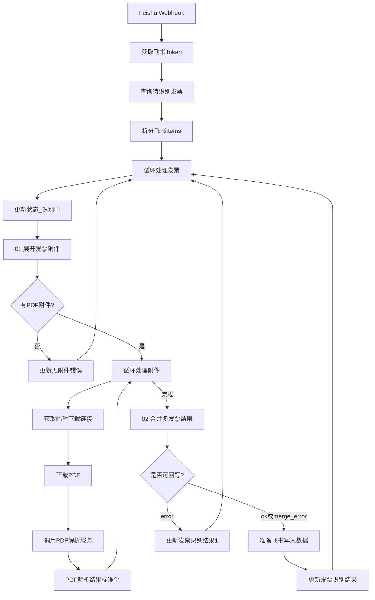

# 发票识别工作流

状态：`已升级（多附件合并）`

## 一、背景与定位

飞书发票表（`tblNd9zgN7ALihwj`）中，用户可在 `[发票]` 附件字段上传 PDF。工作流监听 `feishu-listener` 转发的 Webhook，查询 `识别状态=提交识别` 的记录，逐张解析 PDF 并回写结构化字段。

n8n 工作流名称：`发票识别`（id: `pkVuecTu7UXNzWnA`）

导出文件：[`files/invoice-recognition.workflow.json`](files/invoice-recognition.workflow.json)

升级脚本：[`scripts/upgrade_invoice_workflow.py`](../scripts/upgrade_invoice_workflow.py)

---

## 二、工作流总览

```text
Feishu Listener Webhook
    ↓
获取飞书 Token
    ↓
Search Records（识别状态=提交识别）
    ↓
拆分飞书 Items
    ↓
Split In Batches · 循环处理发票（记录级）
    ↓
更新状态「识别中」
    ↓
Code · 01 展开发票附件（展开全部 PDF）
    ↓
IF · 有 PDF 附件?
    ↓
Split In Batches · 循环处理附件（附件级）
    ↓
获取临时下载链接 → 下载 PDF → pdf-parser /parse → PDF 解析结果标准化
    ↓（附件全部完成后）
Code · 02 合并多发票结果
    ↓
IF · 是否可回写?
    ↓
准备飞书写入数据 → 更新发票识别结果
```



---

## 三、多附件合并规则

| 场景 | 识别状态 | 回写字段 |
| --- | --- | --- |
| 1 张 PDF，识别成功 | `已识别` | 发票号码、开票日期、购方名称、销方名称、价税合计 |
| 多张 PDF，购销方全部一致 | `已识别` | 价税合计 = 各张求和；发票号码 = 各号码用 `，` 拼接；开票日期 = **最早日期** |
| 多张 PDF，购销方不一致 | `错误合并` | 购方名称 = `🔔发票附件中，有多张发票合并识别的，发票必须销售方和购买方一致。` |
| 任一附件识别失败 | `错误` | 仅更新识别状态 |
| 无 PDF 附件 | `错误` | 仅更新识别状态 |

字段映射：

| 用户描述 | 飞书字段 |
| --- | --- |
| 购买方 | `购方名称` |
| 销售方 | `销方名称` |

合并逻辑单元测试：[`scripts/test_invoice_merge_logic.py`](../scripts/test_invoice_merge_logic.py)

---

## 四、飞书表准备（部署前必做）

在 `tblNd9zgN7ALihwj` 的 **`识别状态`** 单选字段中新增选项：

- `错误合并`

现有选项：`提交识别`、`识别中`、`已识别`、`错误`

> 若未添加该选项，购销方不一致时回写 `识别状态=错误合并` 会失败。

---

## 五、节点说明

| 节点 | 作用 |
| --- | --- |
| `01 展开发票附件` | 从 `fields.发票[]` 过滤 PDF，每条附件输出 `tmp_url` + `record_id` |
| `循环处理附件` | 内层 SplitInBatches，逐张下载解析 |
| `02 合并多发票结果` | 按购销方一致性求和/拼接或输出错误合并 |
| `是否可回写?` | `mergeStatus` 为 `ok` / `merge_error` 时进入写入 |
| `准备飞书写入数据` | 格式化飞书 API 字段（日期转 timestamp、金额转数字） |

pdf-parser [`/parse`](../pdf-parser/app.py) **无需改动**，单 PDF 解析能力复用。

---

## 六、部署与测试

### 6.1 应用工作流

工作流已写入 n8n SQLite（`n8n-data/database.sqlite`）。若在其他环境部署：

1. 在 n8n UI 导入 [`files/invoice-recognition.workflow.json`](files/invoice-recognition.workflow.json)
2. 确认 `FEISHU_APP_ID` / `FEISHU_APP_SECRET` 环境变量可用（Token 节点已改用 `$env`）
3. 重启 n8n 容器使工作流缓存刷新：`docker compose restart n8n`

### 6.2 本地逻辑测试

```bash
python3 scripts/test_invoice_merge_logic.py
```

### 6.3 端到端测试（Manual）

| # | 用例 | 期望 |
| --- | --- | --- |
| 1 | 1 张发票 PDF | 与升级前一致 |
| 2 | 2 张 PDF，同购销方 | 价税合计求和；发票号码 `A，B`；开票日期取较早 |
| 3 | 2 张 PDF，不同购销方 | `识别状态=错误合并`；购方名称显示 🔔 提示 |
| 4 | 2 张 PDF，其中 1 张字段不全 | 整单 `识别状态=错误` |
| 5 | 仅非 PDF 附件 | `识别状态=错误` |

操作：在飞书表将记录 `识别状态` 设为 `提交识别` 并上传附件，等待 Webhook 触发。

---

## 七、与现有服务的关系

| 层级 | 文件 / 服务 | 作用 |
| --- | --- | --- |
| 事件监听 | `feishu-listener/config.yaml` → `invoice-bitable-record-changed` | 转发至 `webhook/feishu/invoice` |
| PDF 解析 | `pdf-parser:8000/parse` | 单张发票字段提取（税号配对 + 开户行排除） |
| AI 兜底 | n8n `AI Agent`（DeepSeek） | 字段不完整时补全；提示词禁止把开户银行当作购销方 |
| n8n 工作流 | `files/invoice-recognition.workflow.json` | 多附件编排与合并 |
| 参考实现 | `files/扫描合同识别.json` | 附件展开与 PDF 过滤模式 |
