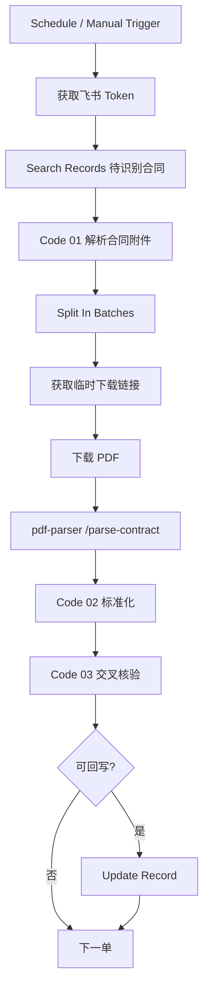

# 合同扫描识别工作流

状态：`待开发`

## 一、背景与定位

从飞书订单表 `[合同]` 附件字段下载 PDF 合同，抽取**第 2 页**与**倒数两页**，经 OCR / 文本解析提取关键活动信息，回写飞书并与业务字段交叉核验。

所属模块：`构建维护飞书业务表plus/外置n8n工作流/`（合同信息提取 / 数据质量巡检）

目标数据表：订单表 `tbl91gZyDPCLhlva`

参考样本：`飞书查询（业务表）返回体参考js.js`

---

## 二、业务目标

| 提取字段 | 说明 | 建议回写字段 |
| --- | --- | --- |
| 活动总费用 | 合同内活动费用合计 | `合同价款`（已有） |
| 活动日期 | 活动执行日期 | 与 `执行日期` 比对 |
| 活动人数 | 参与人数 | 与 `执行人数` 比对 |
| 活动名称 | 团建 / 活动项目名称 | 写入 `识别输出`；可选新增 `合同活动名称` |

---

## 三、工作流总览

```text
触发器（Schedule / Manual）
    ↓
获取飞书 tenant_access_token
    ↓
Search Records（有合同附件 + 合同识别状态=待识别）
    ↓
Code · 01 拆分记录 + 解析合同附件元数据
    ↓
Split In Batches · 逐单处理
    ↓
HTTP · 更新状态「识别中」
    ↓
HTTP · 获取临时下载链接（tmp_url）
    ↓
HTTP · 下载 PDF（binary）
    ↓
HTTP · 调用 pdf-parser `/parse-contract`
    ↓
Code · 02 解析结果标准化
    ↓
Code · 03 与飞书现有字段交叉核验
    ↓
IF · 是否回写
    ↓
HTTP · Update Record
```



---

## 四、飞书 `[合同]` 附件结构

来自 `飞书查询（业务表）返回体参考js.js` 的典型结构：

```json
"合同": [
  {
    "file_token": "CpmEb8RocoybwDxhRQKcqrqxnMc",
    "name": "夸克扫描王_合同(1).pdf",
    "size": 363222,
    "tmp_url": "https://open.feishu.cn/open-apis/drive/v1/medias/batch_get_tmp_download_url?file_tokens=...",
    "type": "application/pdf",
    "url": "https://open.feishu.cn/open-apis/drive/v1/medias/CpmEb8RocoybwDxhRQKcqrqxnMc/download?extra=..."
  }
]
```

下载流程（与现有「发票识别」工作流一致）：

1. 带 `Authorization: Bearer {tenant_access_token}` 请求 `tmp_url`
2. 从响应 `data.tmp_download_urls[0].tmp_download_url` 取真实下载地址
3. 再次 HTTP GET，响应格式设为 `file`（binary）

注意：

- 扫描件 PDF（如夸克扫描王导出）通常**无文本层**，必须 OCR
- 优先使用 `tmp_url`，不要直接用 `url`（需 bitable 权限 extra 参数）
- 一条记录可能有多份合同，默认取**最新一份**（数组最后一项）

---

## 五、PDF 解析策略（pdf-parser `/parse-contract`）

### 5.1 页码选择规则

| 总页数 | 抽取页码（1-based） |
| ---: | --- |
| 1 | 1 |
| 2 | 1, 2 |
| 3 | 2, 3 |
| 5 | 2, 4, 5 |
| n | 2, n-1, n |

逻辑：固定取**第 2 页** + **倒数两页**，去重后升序。

业务假设：

- 第 2 页：活动名称、日期、人数等基本信息
- 倒数两页：费用汇总、签章页、合同价款

### 5.2 OCR 策略

每页处理顺序：

1. PyMuPDF 三种文本引擎（plain / block / words），取最长文本
2. 若有效字符 `< 40`，判定为扫描件，对该页渲染 2x 图片
3. Tesseract `chi_sim+eng` OCR
4. 合并选中页文本，正则提取四个字段

接口：

```http
POST http://pdf-parser:8000/parse-contract
Content-Type: multipart/form-data
file: {binary}
```

响应示例：

```json
{
  "success": true,
  "filename": "夸克扫描王_合同(1).pdf",
  "page_count": 5,
  "selected_pages": [2, 4, 5],
  "fields": {
    "活动名称": "岱山两日团建",
    "活动日期": "2026-06-25",
    "活动人数": "120",
    "活动总费用": "80000.00"
  },
  "text": "--- 第 2 页 ---\n...",
  "pages": [
    { "page": 2, "engine": "ocr", "used_ocr": true, "text_length": 842 }
  ]
}
```

---

## 六、n8n 节点清单

| 序号 | 节点类型 | 节点名称 | 作用 |
| --- | --- | --- | --- |
| 1 | Schedule / Manual Trigger | 定时或手动触发 | 建议每 30 分钟批量处理 |
| 2 | HTTP Request | 获取飞书 Token | `tenant_access_token` |
| 3 | HTTP Request | 查询待识别合同 | Search Records API |
| 4 | Code | **01 解析合同附件** | 解析 `fields.合同[]`，输出下载所需字段 |
| 5 | IF | 有合同附件? | 跳过无 PDF 的记录 |
| 6 | Split In Batches | 循环处理合同 | 逐单处理，避免 OCR 并发过高 |
| 7 | HTTP Request | 更新状态_识别中 | 防重复处理 |
| 8 | HTTP Request | 获取临时下载链接 | 调用 `tmp_url` |
| 9 | HTTP Request | 下载 PDF | responseFormat=file |
| 10 | HTTP Request | 调用合同解析服务 | POST pdf-parser:8000/parse-contract |
| 11 | Code | **02 解析结果标准化** | 清洗四个字段 + 完整性判断 |
| 12 | Code | **03 交叉核验 + 准备回写** | 对比执行日期/人数/合同价款 |
| 13 | IF | 是否回写 | 至少识别出部分字段时回写 |
| 14 | HTTP Request | 回写识别结果 | Update Record |

工作流 JSON 模板：`files/contract-scan-recognition.workflow.json`

---

## 七、飞书表字段准备

### 7.1 需新增字段（建议）

| 字段名 | 类型 | 选项 / 说明 |
| --- | --- | --- |
| `合同识别状态` | 单选 | 待识别 / 识别中 / 已识别 / 识别失败 / 需人工复核 |

触发方式：

- 合同附件上传后，由飞书自动化或公式将 `合同识别状态` 设为「待识别」
- 或 n8n 定时扫描：`合同` 非空 且 `合同识别状态` 为空 → 视为待识别（需调整查询 filter）

### 7.2 已有可复用字段

| 字段 | 用途 |
| --- | --- |
| `合同` | 附件来源（type 17） |
| `合同价款` | 回写 `活动总费用` |
| `执行日期` | 与 `活动日期` 交叉核验 |
| `执行人数` | 与 `活动人数` 交叉核验 |
| `识别输出` | 写入识别摘要（文本） |
| `订单号` | 日志 / 通知 |

---

## 八、Code 节点实现（可直接粘贴 n8n）

> 完整代码已内置于 `files/contract-scan-recognition.workflow.json`，此处摘录核心逻辑。

### 8.1 Code 01 · 解析合同附件

```javascript
function pickContractAttachment(field) {
  if (!Array.isArray(field) || !field.length) return null;
  const pdfs = field.filter((f) => {
    const name = String(f?.name || '').toLowerCase();
    return name.endsWith('.pdf') || String(f?.type || '').includes('pdf');
  });
  const list = pdfs.length ? pdfs : field;
  return list[list.length - 1]; // 取最新一份
}

// 输出：record_id, orderNo, contractTmpUrl, existingContractPrice, existingExecDate, existingExecPeople
```

### 8.2 Code 02 · 解析结果标准化

```javascript
// 输入：pdf-parser /parse-contract 响应
// 输出：活动名称、活动日期、活动人数、活动总费用、字段完整、失败原因
```

### 8.3 Code 03 · 交叉核验

```javascript
// 对比合同识别值 vs 飞书现有值
// 人数/价款/日期不一致 → recognizeStatus = '需人工复核'
// 四字段齐全且无冲突 → '已识别'
// 四字段全缺 → '识别失败'
```

---

## 九、Search Records 配置要点

```json
{
  "field_names": ["订单号", "合同", "合同价款", "执行日期", "执行人数", "合同识别状态"],
  "filter": {
    "conjunction": "and",
    "conditions": [
      {
        "field_name": "合同识别状态",
        "operator": "is",
        "value": ["待识别"]
      }
    ]
  },
  "page_size": 20
}
```

API 路径：

```text
POST /open-apis/bitable/v1/apps/{FEISHU_BASE_ID}/tables/tbl91gZyDPCLhlva/records/search
```

---

## 十、部署 Checklist

- [ ] 重建 pdf-parser 镜像（含 Tesseract + chi_sim）
  ```bash
  docker compose build pdf-parser
  docker compose up -d pdf-parser
  curl http://localhost:8000/health
  ```
- [ ] 飞书订单表新增 `合同识别状态` 单选字段
- [ ] 配置合同上传 → 状态置「待识别」的飞书自动化（或手动测试）
- [ ] 在 n8n 导入 `files/contract-scan-recognition.workflow.json`
- [ ] 用参考样本中带 `合同` 附件的订单做 Manual 测试
- [ ] 根据真实合同样本调优正则（`pdf-parser/app.py` → `extract_contract_fields`）
- [ ] 开启 Schedule（每 30 分钟）
- [ ] 识别失败样本人工抽检 1 周

---

## 十一、与现有服务的关系

| 层级 | 文件 / 服务 | 作用 |
| --- | --- | --- |
| 飞书样本 | `飞书查询（业务表）返回体参考js.js` | 合同附件结构参考 |
| PDF 解析 | `pdf-parser/app.py` → `/parse-contract` | 页码选择 + OCR + 字段提取 |
| n8n 工作流 | `files/contract-scan-recognition.workflow.json` | 生产编排 |
| 参考实现 | n8n「发票识别」工作流 | 飞书附件下载模式 |

---

## 十二、后续增强（可选）

1. **AI 兜底**：OCR 四字段不全时，将 `text` 送入 DeepSeek / 豆包多模态节点补全
2. **Webhook 触发**：合同附件变更事件 → feishu-listener 路由 → n8n Webhook，实时识别
3. **Word 合同**：扩展解析器支持 `.docx`（当前仅 PDF）
4. **识别结果结构化**：新增 `合同活动名称` 等独立字段，便于公式引用
