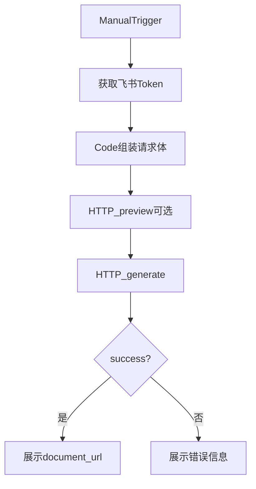

# 合同生成 · n8n 联调测试手册（小白版）

状态：`联调准备（contract-generator 已可用）`

服务地址（Docker 内网）：`http://contract-generator:8030`  
本机调试：`http://localhost:8030`

相关文档：

- [合同生成工作流.md](./合同生成工作流.md)（路径选型）
- [合同生成-路径B实现.md](./合同生成-路径B实现.md)（服务实现规格）
- [contract-generator/README.md](./contract-generator/README.md)（服务说明）

---

## 一、先建立整体印象（1 分钟）

把系统想成流水线：

```text
飞书订单表（业务数据）
        ↓
      n8n（编排：取数、拼参数、调服务、回写）
        ↓
contract-generator（干活：复制模板 + 填空 + 返回文档链接）
        ↓
飞书云文档文件夹（生成好的合同）
```

- **n8n 不负责**改飞书文档内容
- **contract-generator 不负责**读多维表格、不负责改「合同生成状态」
- 两边靠 **HTTP JSON** 说话

本阶段最小目标：在 n8n 里手动点一下，能调通 `POST /api/generate`，并拿到 `document_url`。

---

## 二、contract-generator 是什么

| 问题 | 答案 |
| --- | --- |
| 它是什么 | 一个 Python FastAPI 微服务，端口 `8030` |
| 核心能力 | 复制飞书在线文档模板 → 把 `{{占位符}}` 换成真实值 |
| 配置文件 | `contract-generator/config.yaml`（模板 token、字段映射） |
| 不做什么 | 不读订单表、不写回飞书状态、不解析 PDF |

### 代码谁在处理什么（对应「哪个脚本」）

| 文件 | 职责 | 你什么时候会碰到 |
| --- | --- | --- |
| `app.py` | HTTP 入口：`/api/generate`、`/preview`、`/probe` | n8n HTTP 节点打到这里 |
| `config_loader.py` | 读 `config.yaml`；`signing_unit`→模板；`fields`→占位符值 | 配置驱动模式 |
| `feishu_client.py` | 调飞书：取 token、copy、读 blocks、batch_update | 真正生成文档时 |
| `block_filler.py` | 在文档块里找 `{{key}}` 并替换 | 填空逻辑 |
| `models.py` | 规定请求/响应 JSON 长什么样 | 对照字段用 |
| `config.yaml` | 业务配置（模板、映射、必填） | 换签约单位/改映射时改它 |

---

## 三、n8n 要传什么：两种模式

### 模式 A：配置驱动（联调推荐）

n8n 传「签约单位 + 订单字段」，服务自己查 `config.yaml` 选模板、做映射。

**请求**

```http
POST http://contract-generator:8030/api/generate
Content-Type: application/json
```

```json
{
  "tenant_access_token": "t-xxxxxx",
  "signing_unit": "杭州趣加旅行社服务有限公司",
  "document_name": "合同-TEST-001-趣加旅社",
  "fields": {
    "订单号": "TEST-001",
    "单位": "杭州某某科技有限公司",
    "甲方地址": "杭州市西湖区测试路1号",
    "甲方税号": "91330000MA1234567X",
    "合同价款": 80000,
    "付款方式": "预付50%，活动结束后付尾款",
    "执行日期": "2026/06/25",
    "执行人数": "120",
    "活动名称": "岱山两日团建",
    "活动费用明细": "交通20000；住宿30000；餐饮30000",
    "联系人": "张三",
    "联系方式": "13800138000",
    "策划师": "阿铭"
  }
}
```

**字段说明（小白版）**

| JSON 字段 | 必填？ | 含义 | 谁处理 |
| --- | --- | --- | --- |
| `tenant_access_token` | 建议传 | 飞书访问凭证 | `feishu_client.py`；不传则服务用 `FEISHU_APP_ID/SECRET` 自取 |
| `signing_unit` | 是（本模式） | 飞书「签约单位」选项全称 | `config_loader.resolve_template` → `signing_unit_map` |
| `document_name` | 否 | 新文档标题；不传则用 `合同-{订单号}-趣加旅社` | `format_document_name` |
| `fields` | 是（本模式） | 订单业务字段（字段名 → 值） | `build_placeholder_values` 按 config 映射 |

**`fields` 里的名字从哪来？**  
来自 `config.yaml` 右边的 `{字段名}`，例如：

```yaml
甲方名称: "{单位}"      # 需要 fields["单位"]
活动费用: "{合同价款}"  # 需要 fields["合同价款"]
活动日期: "{执行日期}"  # 需要 fields["执行日期"]
执行人数: "{执行人数}"  # 需要 fields["执行人数"]
```

当前「趣加旅社」建议 `fields` 至少包含：

| fields 键 | 用途 | 填到模板 |
| --- | --- | --- |
| `单位` | 客户公司名 | `{{甲方名称}}` |
| `甲方地址` | 甲方地址 | `{{甲方地址}}` |
| `甲方税号` | 甲方税号 | `{{甲方税号}}` |
| `合同价款` | 金额（数字即可） | `{{活动费用}}`（会格式化成 `80,000.00`） |
| `付款方式` | 付款条款 | `{{付款方式}}` |
| `执行日期` | 活动日期 | `{{活动日期}}` |
| `执行人数` | 人数 | `{{执行人数}}` |
| `活动名称` | 活动名 | `{{活动名称}}` |
| `活动费用明细` | 明细文本 | `{{活动费用明细}}` |
| `订单号` | 文件名 | 文档标题里的 `{订单号}` |
| `联系人` / `联系方式` / `策划师` | 可选 | 模板暂无对应 `{{}}`，传了也不报错 |

乙方名称/地址/税号/开户行/账号：config 里已写死或 `@party_b_full_name`，**不必**从 n8n 传。

`signing_unit` 必须和 map 左边一致，例如：`杭州趣加旅行社服务有限公司` → 模板 `趣加旅社`。

---

### 模式 B：显式 placeholders（POC / 排错用）

自己指定模板 token，并直接给 `{{key}}` 的最终值（绕过 fields 映射）。

```json
{
  "tenant_access_token": "t-xxxxxx",
  "template_token": "QyyUdUdXYoXzklxSUUGcanmenoh",
  "folder_token": "UtBAfoddYlwW3tdA6FTcwiImn1c",
  "document_name": "POC-合同-001",
  "placeholders": {
    "甲方名称": "杭州某某科技有限公司",
    "活动费用": "80,000.00",
    "活动日期": "2026/06/25",
    "执行人数": "120",
    "签订日期": "2026年07月09日"
  }
}
```

联调正式路径请优先用 **模式 A**。

---

## 四、服务内部处理顺序（对照代码）

```text
n8n POST /api/generate
    │
    ▼
app.py
    ├─ resolve_template()          ← config_loader.py（选模板）
    ├─ build_placeholder_values()  ← config_loader.py（fields→最终值）
    ├─ missing_required()          ← 缺必填则失败返回
    ├─ FeishuClient.copy_file()    ← feishu_client.py（复制模板）
    ├─ list_all_blocks()           ← 读文档块
    ├─ build_update_requests()     ← block_filler.py（构造替换）
    └─ batch_update()              ← 写回飞书
    │
    ▼
返回 GenerateResponse JSON
```

**必填检查**（`config.yaml` → `defaults.required_placeholders`）：

- `甲方名称`、`乙方名称`、`活动费用`、`活动日期`  
缺任一 → `success: false`，`error_code: MISSING_REQUIRED_PLACEHOLDER`

---

## 五、contract-generator 输出什么样

### 成功

```json
{
  "success": true,
  "document_id": "FlzBdLceroV6IRxMr1ZcCUZcnsd",
  "file_token": "FlzBdLceroV6IRxMr1ZcCUZcnsd",
  "document_url": "https://qa1iktqu5sj.feishu.cn/docx/FlzBdLceroV6IRxMr1ZcCUZcnsd",
  "document_name": "对齐测试-合同-TEST-ALIGN-001",
  "template_token": "QyyUdUdXYoXzklxSUUGcanmenoh",
  "replaced_blocks": 12,
  "unresolved_placeholders": [],
  "warnings": [],
  "placeholders": { "...最终填进去的键值...": "..." },
  "error_code": null,
  "message": null,
  "details": null
}
```

| 字段 | n8n 怎么用 |
| --- | --- |
| `success` | IF 节点：是否成功 |
| `document_url` | 回写飞书「合同文档链接」或备注 |
| `document_id` / `file_token` | 后续附件/权限用 |
| `replaced_blocks` | 调试：改了多少块 |
| `unresolved_placeholders` | 非空说明模板还有 `{{}}` 没对上 |
| `placeholders` | 调试：看映射结果 |
| `error_code` / `message` | 失败原因 |

### 失败示例

```json
{
  "success": false,
  "error_code": "MISSING_REQUIRED_PLACEHOLDER",
  "message": "必填占位符未解析: 甲方名称",
  "details": { "missing": ["甲方名称"], "signing_unit": "..." }
}
```

常见 `error_code`：`MISSING_REQUIRED_PLACEHOLDER`、`UNKNOWN_SIGNING_UNIT`、`FEISHU_FORBIDDEN`、`FEISHU_RATE_LIMITED`、`MISSING_CREDENTIALS`。

### 先不生成、只看映射：preview

```http
POST http://contract-generator:8030/api/generate/preview
```

body 与 generate 相同（模式 A）。返回 `placeholders`、`missing_required`，**不写飞书**。联调时建议先 preview，再 generate。

---

## 六、最小 n8n 测试工作流结构

先不要接 listener、不要扫全表。最小结构：

```text
Manual Trigger（手动点执行）
    ↓
HTTP · 获取飞书 Token
    ↓
Code · 组装 generate 请求体（写死一条测试订单）
    ↓
HTTP · 调用 preview（可选，建议先做）
    ↓
HTTP · 调用 generate
    ↓
IF · success?
    ├─ 是 → Set/Code 展示 document_url
    └─ 否 → Set 展示 error_code + message
```



### 节点怎么配（照着点）

**1. Manual Trigger**  
手动执行即可。

**2. HTTP · 获取飞书 Token**

- Method: `POST`
- URL: `https://open.feishu.cn/open-apis/auth/v3/tenant_access_token/internal`
- Body JSON：

```json
{
  "app_id": "{{ $env.FEISHU_APP_ID }}",
  "app_secret": "{{ $env.FEISHU_APP_SECRET }}"
}
```

响应里取 `tenant_access_token`。

**3. Code · 组装请求体（可直接粘贴）**

```javascript
const token = $('获取飞书 Token').item.json.tenant_access_token;

return [{
  json: {
    tenant_access_token: token,
    signing_unit: '杭州趣加旅行社服务有限公司',
    document_name: `n8n测试-合同-${Date.now()}`,
    fields: {
      订单号: 'N8N-TEST-001',
      单位: '杭州某某科技有限公司',
      甲方地址: '杭州市西湖区测试路1号',
      甲方税号: '91330000MA1234567X',
      合同价款: 80000,
      付款方式: '预付50%，活动结束后付尾款',
      执行日期: '2026/06/25',
      执行人数: '120',
      活动名称: '岱山两日团建',
      活动费用明细: '交通20000；住宿30000；餐饮30000',
      联系人: '张三',
      联系方式: '13800138000',
      策划师: '阿铭',
    },
  },
}];
```

**4. HTTP · preview（可选）**

- URL: `http://contract-generator:8030/api/generate/preview`
- Method: `POST`
- Body: `{{ JSON.stringify($json) }}`
- 看 `missing_required` 是否为空。

**5. HTTP · generate**

- URL: `http://contract-generator:8030/api/generate`
- Method: `POST`
- Body: 同上
- Timeout: 建议 `120000`（2 分钟）

**6. IF**

- 条件：`{{ $json.success }}` 为 true
- true 分支：记下 `document_url`，浏览器打开检查
- false 分支：看 `error_code` / `message`

---

## 七、边测边学：建议顺序

| 步骤 | 做什么 | 学会什么 |
| --- | --- | --- |
| 1 | 浏览器打开 `http://localhost:8030/health` | 服务是否活着 |
| 2 | `GET /api/templates` | config 是否加载到「趣加旅社」 |
| 3 | n8n 只跑到 **preview** | `fields` 映射是否正确、必填是否齐 |
| 4 | n8n 跑 **generate** | 端到端是否通 |
| 5 | 打开返回的 `document_url` | 占位符是否都替换掉 |
| 6 |（下一步）改成从飞书 Get Record 取真实订单 | 真实业务联调 |

**验收标准（最小）**

- [ ] `success === true`
- [ ] `document_url` 能打开
- [ ] `unresolved_placeholders` 为空（或你已知可忽略的 key）
- [ ] `replaced_blocks` ≥ 1
- [ ] 文档里看不到残留 `{{甲方名称}}` 这类占位符

---

## 八、常见坑（联调时对照）

| 现象 | 原因 | 处理 |
| --- | --- | --- |
| n8n 连不上服务 | URL 写错 | 容器内用 `http://contract-generator:8030`，本机 curl 用 `localhost` |
| `UNKNOWN_SIGNING_UNIT` | 签约单位名称不一致 | 必须与 `signing_unit_map` 左边完全一致 |
| `MISSING_REQUIRED_PLACEHOLDER` | fields 缺映射源 | 检查 `单位`、`合同价款`、`执行日期` 等 |
| 403 / FEISHU_FORBIDDEN | 机器人无文档/文件夹权限 | 给应用加协作者 |
| 文档还有 `{{执行人数}}` | key 名写错 | 模板是 `执行人数`，不是 `活动人数` |
| Token 过期 | `t-` 有时效 | 每次工作流先重新取 token |

---

## 九、本阶段明确不做

- feishu-listener 自动触发
- 回写「合同生成状态」
- 上传附件到「合同」字段
- 多签约单位全量模板

先把「Manual → generate → 打开链接」跑稳，再加这些。
