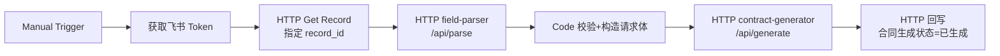

# 合同生成 — 路径 B 实现与实验验证文档

状态：`实验验证阶段（待开发 contract-generator 服务）`

上级文档：[合同生成工作流.md](./合同生成工作流.md)（技术路径选型）

---

## 一、文档定位

本文档是 **路径 B（contract-generator 服务 + 飞书 Block API）** 的落地实现说明，面向「先跑通实验验证、再接入 n8n 生产工作流」的开发顺序。

| 阶段 | 目标 | 本文档覆盖 |
| --- | --- | --- |
| **Phase B-0** | 飞书权限 + 模板 token 就绪 | ✅ 准备清单 |
| **Phase B-1** | 服务骨架 + copy 模板 | ✅ 目录结构、Docker |
| **Phase B-2** | Block 遍历 + 占位符替换 | ✅ 核心算法 |
| **Phase B-3** | curl / 脚本单条验证 | ✅ 实验步骤 |
| **Phase B-4** | n8n 最小工作流联调 | ✅ 节点清单 |
| Phase B-5 | feishu-listener 实时触发 | 概要（生产阶段） |

路径 C（本地 DOCX 兜底）不在本文档实现范围内，仅在 § 十二 说明扩展点。

---

## 二、总体架构

```mermaid
flowchart TB
  subgraph trigger["触发层（Phase B-4 起）"]
    n8n["n8n 工作流"]
    listener["feishu-listener"]
  end

  subgraph existing["已有服务"]
    fp["feishu-field-parser :8020"]
  end

  subgraph new_svc["新增服务 contract-generator :8030"]
    api["FastAPI /api/generate"]
    cfg["config.yaml 模板映射"]
    feishu["FeishuClient\n限速 + 重试"]
    copy["copy_template()"]
    fill["fill_placeholders()"]
    api --> cfg
    api --> feishu
    feishu --> copy --> fill
  end

  subgraph feishu_api["飞书开放平台"]
    drive["drive/v1/files/copy"]
    blocks["docx/v1/blocks"]
    batch["docx/v1/blocks/batch_update"]
  end

  n8n --> fp
  n8n --> api
  listener -.->|生产| n8n
  feishu --> drive
  feishu --> blocks
  feishu --> batch
```



### 2.1 设计原则

1. **与现有栈一致**：Python 3.12 + FastAPI + uvicorn + Docker Compose，模式同 `pdf-parser`、`feishu-field-parser`。
2. **n8n 薄编排**：n8n 负责触发、取数、回写；Block 遍历、限速、重试集中在 `contract-generator`。
3. **配置外置**：签约单位 → 模板 token、占位符映射、文件夹 token 全部在 `config.yaml`，不改代码即可换模板。
4. **实验优先**：Phase B-3 用 curl 直接调 `/api/generate`，不依赖 n8n，降低调试成本。

### 2.2 服务边界

| 职责 | contract-generator | n8n | feishu-field-parser |
| --- | --- | --- | --- |
| 获取 tenant_access_token | 可选（支持传入或自行获取） | ✅ 默认由 n8n 获取 | — |
| 读取多维表格记录 | ❌ | ✅ | — |
| 字段 ID → 字段名 | ❌ | 调 field-parser | ✅ |
| 复制模板 | ✅ | — | — |
| Block 占位符替换 | ✅ | — | — |
| 回写 `合同生成状态` | ❌ | ✅ | — |

---

## 三、服务目录结构（待创建）

```text
contract-generator/
├── app.py                 # FastAPI 入口、路由
├── feishu_client.py       # 飞书 API 封装（token、copy、blocks、batch_update）
├── block_filler.py        # 块树遍历、占位符替换、批量更新
├── config_loader.py       # 读取 config.yaml、模板解析
├── models.py              # Pydantic 请求/响应模型
├── config.yaml            # 模板与占位符映射（挂载到容器）
├── requirements.txt
├── Dockerfile
├── README.md
├── test_block_filler.py   # 单元测试（mock 块数据）
└── scripts/
    ├── probe_template.py  # 实验脚本：打印模板中所有占位符
    └── smoke_generate.sh  # 实验脚本：curl 调用 /api/generate
```

---

## 四、依赖与 Docker

### 4.1 requirements.txt

```text
fastapi==0.115.6
uvicorn[standard]==0.34.0
httpx==0.28.1
PyYAML==6.0.2
pydantic==2.10.4
```

说明：

- 使用 `httpx` 异步/同步 HTTP 客户端调用飞书 API（与 `feishu-listener` 一致）。
- 不引入 `lark-oapi` SDK，保持服务轻量；API 面清晰可控。

### 4.2 Dockerfile

与 `feishu-field-parser/Dockerfile` 相同模式：

```dockerfile
ARG BASE_IMAGE=docker.1ms.run/library/python:3.12-slim
FROM ${BASE_IMAGE}

WORKDIR /app

COPY requirements.txt .
RUN pip install --no-cache-dir -r requirements.txt \
    -i https://pypi.tuna.tsinghua.edu.cn/simple

COPY app.py feishu_client.py block_filler.py config_loader.py models.py ./

EXPOSE 8030

CMD ["python", "app.py"]
```

### 4.3 compose.yaml 追加片段

```yaml
  contract-generator:
    build:
      context: ./contract-generator
      args:
        BASE_IMAGE: ${CONTRACT_GENERATOR_BASE_IMAGE:-docker.1ms.run/library/python:3.12-slim}
    container_name: contract-generator
    ports:
      - "8030:8030"
    volumes:
      - ./contract-generator/config.yaml:/app/config.yaml:ro
    environment:
      - TZ=Asia/Shanghai
      - CONTRACT_GENERATOR_CONFIG_PATH=/app/config.yaml
      - CONTRACT_GENERATOR_PORT=8030
      - FEISHU_APP_ID=${FEISHU_APP_ID}
      - FEISHU_APP_SECRET=${FEISHU_APP_SECRET}
      - LOG_LEVEL=INFO
      # 实验阶段可选：预填模板/文件夹 token，config.yaml 留空时使用
      - FEISHU_CONTRACT_TEMPLATE_TOKEN=${FEISHU_CONTRACT_TEMPLATE_TOKEN:-}
      - FEISHU_CONTRACT_OUTPUT_FOLDER=${FEISHU_CONTRACT_OUTPUT_FOLDER:-}
    restart: unless-stopped
```

### 4.4 .env.example 追加

```env
# 合同生成（路径 B 实验）
# CONTRACT_GENERATOR_BASE_IMAGE=docker.1ms.run/library/python:3.12-slim
# FEISHU_CONTRACT_TEMPLATE_TOKEN=doxcnXXXXXXXX   # POC 用单个模板 token
# FEISHU_CONTRACT_OUTPUT_FOLDER=fldcnXXXXXXXX    # POC 输出文件夹 token
```

---

## 五、config.yaml 完整 schema

```yaml
# contract-generator/config.yaml

defaults:
  # 未按签约单位匹配时的兜底模板（实验阶段常用）
  template_token: "${FEISHU_CONTRACT_TEMPLATE_TOKEN}"
  folder_token: "${FEISHU_CONTRACT_OUTPUT_FOLDER}"
  document_name_pattern: "合同-{订单号}"   # 支持 {字段名} 占位

  # 占位符语法：模板 docx 内写 {{甲方名称}}，此处 key 为「去掉花括号」后的名称
  required_placeholders:
    - 甲方名称
    - 乙方名称
    - 合同价款
    - 活动日期

  # 飞书 Block API 限速（保守值，低于官方 5 QPS）
  rate_limit:
    read_qps: 4.0
    write_qps: 3.0
    copy_retry_max: 3
    copy_retry_delay_ms: 800

templates:
  趣加旅社:
    template_token: "doxcnTemplateAAA"
    folder_token: "fldcnOutputFolder"
    document_name_pattern: "合同-{订单号}-趣加旅社"
    # 乙方全称（签约单位选项 → 合同内正式名称）
    party_b_full_name: "杭州趣加旅社有限公司"
    placeholders:
      甲方名称: "{单位}"
      甲方联系人: "{联系人}"
      甲方电话: "{联系方式}"
      乙方名称: "@party_b_full_name"          # 特殊：引用上方常量
      合同价款: "{合同价款}"
      活动日期: "{执行日期}"
      活动人数: "{执行人数}"
      活动描述: "{客户需求}"
      订单号: "{订单号}"
      策划师: "{策划师}"
      签订日期: "@today"                      # 特殊：生成当日

  趣加文化创意:
    template_token: "doxcnTemplateBBB"
    folder_token: "fldcnOutputFolder"
    document_name_pattern: "合同-{订单号}-趣加文化创意"
    party_b_full_name: "杭州趣加文化创意有限公司"
    placeholders: { ... }

# 签约单位（飞书单选名称）→ templates 键名
signing_unit_map:
  趣加旅社: 趣加旅社
  趣加文化创意: 趣加文化创意
  趣顽: 趣顽
  旅苑国际旅行社有限公司第一分公司: 旅苑
  趣加体育文化: 趣加体育文化
  趣加管理咨询: 趣加管理咨询
```

### 5.1 占位符映射规则

| 映射值格式 | 含义 | 示例 |
| --- | --- | --- |
| `{字段名}` | 从 n8n 传入的 `fields` 对象取值 | `{合同价款}` → `80000` |
| `@party_b_full_name` | 取当前模板配置的乙方全称 | 固定字符串 |
| `@today` | 生成当日，格式 `yyyy年MM月dd日` | `2026年07月08日` |
| 字面量 | 不含 `{}` 和 `@` 前缀则原样写入模板 key | 少用 |

n8n 侧只需把 field-parser 解析后的 `object` 作为 `fields` 传入；服务内部按 `placeholders` 映射表生成最终的 `{{key}} → value` 字典。

---

## 六、API 设计

### 6.1 端点一览

| 方法 | 路径 | 用途 |
| --- | --- | --- |
| `GET` | `/health` | 健康检查 |
| `GET` | `/api/templates` | 列出 config 中已配置模板 |
| `POST` | `/api/probe` | **实验专用**：扫描模板内所有 `{{...}}` 占位符 |
| `POST` | `/api/generate` | 复制模板 + 填充 + 返回文档 URL |
| `POST` | `/api/generate/preview` | **实验专用**：dry-run，只返回将替换的键值，不写飞书 |

### 6.2 POST /api/generate

**请求**

```json
{
  "tenant_access_token": "t-xxx",
  "signing_unit": "趣加旅社",
  "document_name": "合同-TEST-001",
  "fields": {
    "订单号": "TEST-001",
    "单位": "杭州某某科技有限公司",
    "联系人": "张三",
    "联系方式": "13800138000",
    "合同价款": 80000,
    "执行日期": "2026/06/25",
    "执行人数": "120",
    "客户需求": "两日团建活动",
    "策划师": "阿铭"
  },
  "options": {
    "dry_run": false,
    "skip_unresolved_warnings": false
  }
}
```

也可显式指定模板（绕过 signing_unit 映射，POC 常用）：

```json
{
  "tenant_access_token": "t-xxx",
  "template_token": "doxcnXXXXXXXX",
  "folder_token": "fldcnXXXXXXXX",
  "document_name": "POC-合同-001",
  "placeholders": {
    "甲方名称": "杭州某某科技有限公司",
    "乙方名称": "杭州趣加旅社有限公司",
    "合同价款": "80,000.00",
    "活动日期": "2026/06/25",
    "活动人数": "120",
    "签订日期": "2026年07月08日"
  }
}
```

**成功响应**

```json
{
  "success": true,
  "document_id": "doxcnNewDocXXX",
  "file_token": "doxcnNewDocXXX",
  "document_url": "https://feishu.cn/docx/doxcnNewDocXXX",
  "document_name": "合同-TEST-001",
  "template_token": "doxcnTemplateAAA",
  "replaced_blocks": 8,
  "unresolved_placeholders": [],
  "warnings": []
}
```

**失败响应**

```json
{
  "success": false,
  "error_code": "MISSING_REQUIRED_PLACEHOLDER",
  "message": "必填占位符未解析: 甲方名称",
  "details": {
    "signing_unit": "趣加旅社",
    "missing": ["甲方名称"]
  }
}
```

### 6.3 POST /api/probe（实验专用）

扫描模板文档，列出所有 `{{占位符}}`，用于对照 config 是否遗漏：

```json
{
  "tenant_access_token": "t-xxx",
  "template_token": "doxcnXXXXXXXX"
}
```

响应：

```json
{
  "template_token": "doxcnXXXXXXXX",
  "placeholders_found": [
    {"key": "甲方名称", "block_id": "doxcnAAA", "sample": "{{甲方名称}}"},
    {"key": "合同价款", "block_id": "doxcnBBB", "sample": "金额：{{合同价款}} 元"}
  ],
  "block_count": 47,
  "text_block_count": 32
}
```

---

## 七、核心模块实现说明

### 7.1 FeishuClient（feishu_client.py）

#### 7.1.1 Token 获取

```python
POST https://open.feishu.cn/open-apis/auth/v3/tenant_access_token/internal
Content-Type: application/json

{"app_id": "...", "app_secret": "..."}
```

实验阶段：**优先使用 n8n 传入的 `tenant_access_token`**，避免服务内硬编码密钥；若请求体未传且环境变量有 `FEISHU_APP_ID/SECRET`，则服务自行获取。

#### 7.1.2 复制模板

```python
POST /open-apis/drive/v1/files/{template_token}/copy

{
  "name": "合同-TEST-001",
  "type": "docx",
  "folder_token": "fldcnXXXXXXXX"
}
```

**重试策略**（官方错误码 `1061045 can retry`）：

```python
for attempt in range(max_retries):
    resp = client.post(...)
    if resp["code"] == 0:
        return resp["data"]["file"]
    if resp["code"] in (1061045, 99991400):
        time.sleep(base_delay * (2 ** attempt))
        continue
    raise FeishuAPIError(resp)
```

限制：5 QPS、10000 次/天、不支持并发 copy — 服务内对 copy 加全局锁或队列。

#### 7.1.3 获取全部 Block

**推荐策略**：一次调用 `with_descendants=true` 获取整棵树，减少分页往返。

```python
GET /open-apis/docx/v1/documents/{document_id}/blocks/{document_id}/children
    ?document_revision_id=-1
    &page_size=500
    &with_descendants=true
```

说明：

- 根 block 的 `block_id` 通常等于 `document_id`。
- 若 `has_more=true`，用 `page_token` 继续分页。
- 备选：顶层 `GET /documents/{id}/blocks` 只返回第一层，表格单元格需再递归 children；`with_descendants=true` 更简单。

#### 7.1.4 批量更新 Block

```python
PATCH /open-apis/docx/v1/documents/{document_id}/blocks/batch_update

{
  "requests": [
    {
      "block_id": "doxcnXXX",
      "update_text_elements": {
        "elements": [ ... ]   # 必须传完整 elements 数组
      }
    }
  ]
}
```

**关键约束**（来自官方文档）：

1. `update_text_elements` 会**整体替换**该 block 的 elements，必须保留原有 `text_element_style`。
2. 单次 requests 数量建议 ≤ 20（官方未硬性限制，但过大易触发 99991400）。
3. 写操作限速约 3 QPS，批次间 `sleep(0.35)`。

### 7.2 BlockFiller（block_filler.py）

#### 7.2.1 支持的 block 类型

| block_type | 名称 | 是否含 text.elements | 实验阶段 |
| --- | ---: | --- | --- |
| 1 | Page | 否（容器） | 跳过 |
| 2 | Text | ✅ | **主要处理** |
| 3 | Heading1 | ✅ | **主要处理** |
| 4-11 | Heading2-9 等 | ✅ | **主要处理** |
| 12 | Bullet | ✅ | 支持 |
| 13 | Ordered | ✅ | 支持 |
| 14 | Code | ✅ | 支持 |
| 15 | Quote | ✅ | 支持 |
| 31 | Table | 否（容器） | 递归 children |
| 32 | TableCell | ✅ | **需支持** |

实现：遍历 block 时，若存在 `block["text"]["elements"]`，则进入文本替换逻辑；若 `block_type == 31`（Table），依赖 `with_descendants=true` 已展开的子 block，无需单独递归。

#### 7.2.2 占位符正则

```python
PLACEHOLDER_RE = re.compile(r"\{\{([^{}]+)\}\}")
```

匹配 `{{甲方名称}}`、`{{合同价款}}`；不匹配 `{甲方名称}` 或 `{{ a }}`（含空格的关键字需在模板规范中禁止）。

#### 7.2.3 单 block 替换算法（保留样式）

```python
def replace_in_block(block: dict, values: dict[str, str]) -> dict | None:
    """若 block 文本有变化，返回 batch_update request；否则 None。"""
    text_obj = block.get("text")
    if not text_obj or not text_obj.get("elements"):
        return None

    changed = False
    new_elements = []

    for element in text_obj["elements"]:
        text_run = element.get("text_run")
        if not text_run:
            # mention_doc、equation 等非 text_run 元素原样保留
            new_elements.append(element)
            continue

        content = text_run.get("content", "")
        new_content = PLACEHOLDER_RE.sub(
            lambda m: values.get(m.group(1).strip(), m.group(0)),
            content,
        )

        if new_content != content:
            changed = True

        new_elements.append({
            "text_run": {
                "content": new_content,
                "text_element_style": text_run.get("text_element_style", {}),
            }
        })

    if not changed:
        return None

    return {
        "block_id": block["block_id"],
        "update_text_elements": {"elements": new_elements},
    }
```

**为何必须保留 `text_element_style`**：模板中「加粗标题」「下划线金额」等样式在 element 级别；若只传 `content` 不传 style，飞书 API 可能重置样式。

#### 7.2.4 跨 text_run 的占位符问题

若模板写成：`金额：{{` + `合同价款` + `}}`（三个 text_run），正则在单个 run 内无法匹配完整占位符。

**实验阶段规范（强制）**：

- 每个 `{{占位符}}` 必须在**同一个 text_run** 内，不跨样式片段。
- `/api/probe` 扫描后，若发现 `{{` 和 `}}` 分布在不同 block/run，写入 `warnings`。

**后续增强**（非实验范围）：合并相邻 text_run 后再替换。

#### 7.2.5 批量提交

```python
def batch_update_all(client, document_id, requests, batch_size=20, delay=0.35):
    for i in range(0, len(requests), batch_size):
        chunk = requests[i : i + batch_size]
        client.batch_update(document_id, chunk)
        time.sleep(delay)
```

### 7.3 主流程 generate（app.py）

```python
def generate_contract(req: GenerateRequest) -> GenerateResponse:
    token = req.tenant_access_token or client.get_tenant_token()

    # 1. 解析模板配置
    tpl = resolve_template(req)  # signing_unit 或显式 template_token

    # 2. 构建 placeholders 字典
    values = build_placeholder_values(tpl, req.fields or {}, req.placeholders or {})

    # 3. 校验必填
    missing = [k for k in tpl.required if not values.get(k)]
    if missing:
        raise MissingPlaceholderError(missing)

    if req.options.dry_run:
        return preview_response(values)

    # 4. 复制模板
    doc_name = format_document_name(tpl.document_name_pattern, req)
    copied = client.copy_file(tpl.template_token, tpl.folder_token, doc_name)
    document_id = copied["token"]

    # 5. 获取 blocks
    blocks = client.list_all_blocks(document_id)

    # 6. 构建 update requests
    requests = []
    for block in blocks:
        req_item = replace_in_block(block, values)
        if req_item:
            requests.append(req_item)

    # 7. 批量更新
    if requests:
        batch_update_all(client, document_id, requests)

    # 8. 检查未替换的占位符
    unresolved = find_unresolved(blocks, values)  # 可选：更新后再 GET 一次

    return GenerateResponse(
        success=True,
        document_id=document_id,
        file_token=document_id,
        document_url=copied.get("url") or f"https://feishu.cn/docx/{document_id}",
        replaced_blocks=len(requests),
        unresolved_placeholders=unresolved,
    )
```

---

## 八、字段格式化（build_placeholder_values）

n8n / field-parser 传入的原始值需在进入 Block 替换前格式化：

| 占位符 key | 来源字段 | 格式化规则 |
| --- | --- | --- |
| 合同价款 | `合同价款` | `f"{float(v):,.2f}"` → `80,000.00` |
| 活动日期 | `执行日期` | 已是 `yyyy/MM/dd` 则保留；时间戳则转本地日期 |
| 活动人数 | `执行人数` | 取数字部分，去「人」后缀 |
| 签订日期 | `@today` | `datetime.now().strftime("%Y年%m月%d日")` |
| 乙方名称 | `@party_b_full_name` | 读 config 常量 |

```python
def format_currency(value) -> str:
    if value is None or value == "":
        return ""
    return f"{float(str(value).replace(',', '')):,.2f}"
```

---

## 九、实验验证步骤（Phase B-0 → B-3）

### 9.0 准备清单

- [ ] 飞书应用已开通权限：`docs:document:copy`、`docx:document`、`drive:drive`
- [ ] 机器人已加入**模板文件夹**（阅读）和**输出文件夹**（编辑）
- [ ] 已创建 1 份测试模板 docx，含 ≥ 5 个 `{{占位符}}`（见 § 9.2）
- [ ] 记录 `template_token`（URL 中 `/docx/` 后那段）和 `folder_token`
- [ ] `.env` 中 `FEISHU_APP_ID`、`FEISHU_APP_SECRET` 已配置

### 9.1 获取 token（手动）

```bash
curl -s -X POST 'https://open.feishu.cn/open-apis/auth/v3/tenant_access_token/internal' \
  -H 'Content-Type: application/json' \
  -d "{\"app_id\":\"$FEISHU_APP_ID\",\"app_secret\":\"$FEISHU_APP_SECRET\"}" \
  | jq -r '.tenant_access_token'
```

导出：`export FEISHU_TOKEN="t-xxx"`

### 9.2 模板设计（POC 最小模板）

在飞书云文档创建 `合同模板-POC-v1`，内容示例：

```text
团建活动合同

甲方（委托方）：{{甲方名称}}
联系人：{{甲方联系人}}    电话：{{甲方电话}}
乙方（受托方）：{{乙方名称}}

活动日期：{{活动日期}}
活动人数：{{活动人数}} 人
活动描述：{{活动描述}}
合同价款：人民币 {{合同价款}} 元（含税）

订单编号：{{订单号}}
策划师：{{策划师}}

签订日期：{{签订日期}}
```

**注意**：每个 `{{...}}` 不要拆成不同颜色/加粗片段。

### 9.3 验证 copy（不经过服务，确认权限）

```bash
curl -s -X POST \
  "https://open.feishu.cn/open-apis/drive/v1/files/${TEMPLATE_TOKEN}/copy" \
  -H "Authorization: Bearer ${FEISHU_TOKEN}" \
  -H 'Content-Type: application/json' \
  -d "{
    \"name\": \"POC-copy-test-$(date +%s)\",
    \"type\": \"docx\",
    \"folder_token\": \"${FOLDER_TOKEN}\"
  }" | jq .
```

期望：`code: 0`，`data.file.token` 和 `url` 存在。

### 9.4 启动 contract-generator

```bash
docker compose build contract-generator
docker compose up -d contract-generator
curl http://localhost:8030/health
# 期望：{"status":"ok"}
```

### 9.5 探测模板占位符

```bash
curl -s -X POST http://localhost:8030/api/probe \
  -H 'Content-Type: application/json' \
  -d "{
    \"tenant_access_token\": \"${FEISHU_TOKEN}\",
    \"template_token\": \"${TEMPLATE_TOKEN}\"
  }" | jq .
```

核对：`placeholders_found` 与模板、config.yaml 一致。

### 9.6 单次生成实验

```bash
curl -s -X POST http://localhost:8030/api/generate \
  -H 'Content-Type: application/json' \
  -d "{
    \"tenant_access_token\": \"${FEISHU_TOKEN}\",
    \"template_token\": \"${TEMPLATE_TOKEN}\",
    \"folder_token\": \"${FOLDER_TOKEN}\",
    \"document_name\": \"POC-合同-$(date +%Y%m%d%H%M%S)\",
    \"placeholders\": {
      \"甲方名称\": \"杭州某某科技有限公司\",
      \"甲方联系人\": \"张三\",
      \"甲方电话\": \"13800138000\",
      \"乙方名称\": \"杭州趣加旅社有限公司\",
      \"活动日期\": \"2026/06/25\",
      \"活动人数\": \"120\",
      \"活动描述\": \"岱山两日团建\",
      \"合同价款\": \"80,000.00\",
      \"订单号\": \"POC-001\",
      \"策划师\": \"阿铭\",
      \"签订日期\": \"2026年07月08日\"
    }
  }" | jq .
```

### 9.7 实验验收标准

| # | 验收项 | 通过标准 |
| --- | --- | --- |
| 1 | copy 成功 | 输出文件夹出现新文档 |
| 2 | 占位符替换 | 打开文档，所有 `{{}}` 消失，值正确 |
| 3 | 样式保留 | 标题加粗、表格边框未被破坏 |
| 4 | replaced_blocks | ≥ 占位符数量（一段含多个占位符计 1 block） |
| 5 | unresolved 为空 | 无遗漏占位符 |
| 6 | 重复执行 | 连续 3 次生成不触发 1061045/99991400 |
| 7 | 错误路径 | 故意少传「甲方名称」，返回 4xx 且 message 明确 |

### 9.8 常见问题排查

| 现象 | 错误码 | 原因 | 处理 |
| --- | --- | --- | --- |
| copy 403 | 1061004 | 机器人无模板读/文件夹写权限 | 加协作者 |
| blocks 403 | 1061004 | 无 docx 编辑权限 | 开 `docx:document` |
| 429/400 | 99991400 | 超 QPS | 加大 batch 间隔 |
| copy 失败 | 1061045 | 异步可重试 | 服务内 retry |
| 占位符未替换 | — | 跨 text_run 或 key 名不一致 | 改模板或跑 `/api/probe` |
| 样式丢失 | — | update 时未带 text_element_style | 检查 § 7.2.3 |

---

## 十、n8n 最小联调工作流（Phase B-4）

实验通过后，导入最小工作流 `files/contract-generate-poc.workflow.json`（待创建），节点如下：



### 10.1 Code 节点：构造 generate 请求

```javascript
const parsed = $json.object || $json;  // field-parser 输出
const recordId = $('HTTP Get Record').item.json.data.record.record_id;

const required = ['单位', '签约单位', '合同价款', '执行日期'];
const missing = required.filter(k => !parsed[k]);
if (missing.length) {
  throw new Error(`缺少必填字段: ${missing.join(', ')}`);
}

return [{
  json: {
    record_id: recordId,
    tenant_access_token: $('获取飞书 Token').item.json.tenant_access_token,
    signing_unit: parsed['签约单位'],
    document_name: `合同-${parsed['订单号'] || recordId}`,
    fields: parsed,
  },
}];
```

### 10.2 HTTP 节点：调用 contract-generator

```text
POST http://contract-generator:8030/api/generate
Body: ={{ JSON.stringify($json) }}
Timeout: 120000
```

### 10.3 回写飞书

```json
{
  "fields": {
    "合同生成状态": "已生成",
    "合同文档链接": {
      "text": "查看合同",
      "link": "{{ $json.document_url }}"
    }
  }
}
```

> 若尚未新增 `合同文档链接` 字段，实验阶段可只回写 `合同生成状态`，文档 URL 写入 `检查备注`。

---

## 十一、单元测试策略

### 11.1 test_block_filler.py（不依赖飞书）

用 fixtures 模拟 block 结构：

```python
def test_replace_single_placeholder():
    block = {
        "block_id": "blk1",
        "text": {
            "elements": [{
                "text_run": {
                    "content": "甲方：{{甲方名称}}",
                    "text_element_style": {"bold": True},
                }
            }]
        },
    }
    req = replace_in_block(block, {"甲方名称": "测试公司"})
    assert req is not None
    assert "测试公司" in req["update_text_elements"]["elements"][0]["text_run"]["content"]
    assert req["update_text_elements"]["elements"][0]["text_run"]["text_element_style"]["bold"] is True


def test_preserve_mention_doc():
    block = {
        "block_id": "blk2",
        "text": {
            "elements": [
                {"text_run": {"content": "见"}},
                {"mention_doc": {"token": "doxxx", "obj_type": 22}},
            ]
        },
    }
    req = replace_in_block(block, {})
    assert req is None  # 无占位符则不更新
```

### 11.2 集成测试（可选，需真实 token）

`scripts/smoke_generate.sh` 封装 § 9.6，CI 不跑，本地手动执行。

---

## 十二、路径 C 扩展点（兜底，后续）

当 Block API 无法满足复杂模板（如表格行动态扩行）时，在**同一服务**增加模式：

```python
if tpl.mode == "docx_template":
    return generate_from_local_docx(tpl, values)
else:
    return generate_from_block_replace(tpl, values)
```

| 项目 | 路径 B | 路径 C 扩展 |
| --- | --- | --- |
| 模板位置 | 飞书云文档 | `contract-generator/templates/*.docx` |
| 填充库 | Block API | `docxtpl` (Jinja2) |
| 输出 | 飞书在线 docx（copy 后改） | `upload_all` 上传 docx |
| config 字段 | `template_token` | `local_template_path` |

实验阶段**不实现**路径 C，仅在 `models.py` 预留 `mode: "block_replace" | "docx_template"`。

---

## 十三、生产化待办（实验通过后）

| 项 | 说明 |
| --- | --- |
| feishu-listener 路由 | `合同生成状态=待生成` → `/webhook/feishu/contract-generate` |
| Schedule 兜底 | 每 30 分钟扫描遗漏 |
| 状态机 | 待生成 → 生成中 → 已生成/失败/需重试 |
| 并发控制 | n8n Split In Batches batchSize=1 |
| 多模板上线 | 补全 6 个签约单位 config |
| 附件回写 | 导出 PDF + upload 到 `[合同]` 字段（可选） |
| 监控 | 记录 `replaced_blocks`、`warnings` 到日志 |

---

## 十四、开发任务拆分（建议顺序）

| 序号 | 任务 | 预估 | 依赖 |
| --- | --- | --- | --- |
| 1 | 创建 `contract-generator/` 骨架 + `/health` | 0.5d | — |
| 2 | 实现 `FeishuClient.copy_file` + 重试 | 0.5d | 飞书权限 |
| 3 | 实现 `FeishuClient.list_all_blocks` | 0.5d | — |
| 4 | 实现 `block_filler.replace_in_block` + 单元测试 | 1d | — |
| 5 | 实现 `FeishuClient.batch_update` + 分批限速 | 0.5d | — |
| 6 | 实现 `/api/probe`、`/api/generate` | 0.5d | 2-5 |
| 7 | compose 集成 + POC 模板实验 | 0.5d | 6 |
| 8 | n8n 最小工作流联调 | 0.5d | 7 |
| **合计** | | **~4.5d** | |

---

## 十五、参考

- 上级选型：[合同生成工作流.md](./合同生成工作流.md)
- 飞书 [复制文件](https://open.feishu.cn/document/server-docs/docs/drive-v1/file/copy)
- 飞书 [批量更新块](https://open.feishu.cn/document/server-docs/docs/docs/docx-v1/document-block/batch_update)
- 飞书 [获取块子节点](https://open.feishu.cn/document/server-docs/docs/docs/docx-v1/document-block/get-2)
- 项目参考实现：`feishu-field-parser/`、`pdf-parser/`
- 发票工作流模式：[发票识别工作流.md](./发票识别工作流.md)
