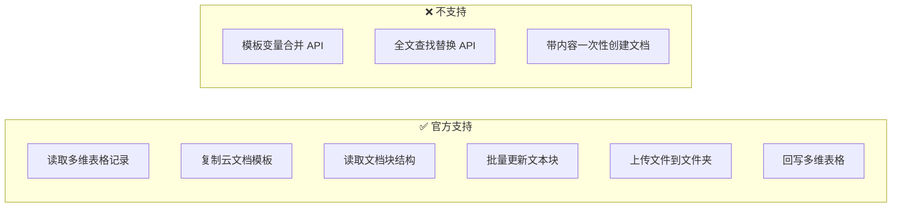
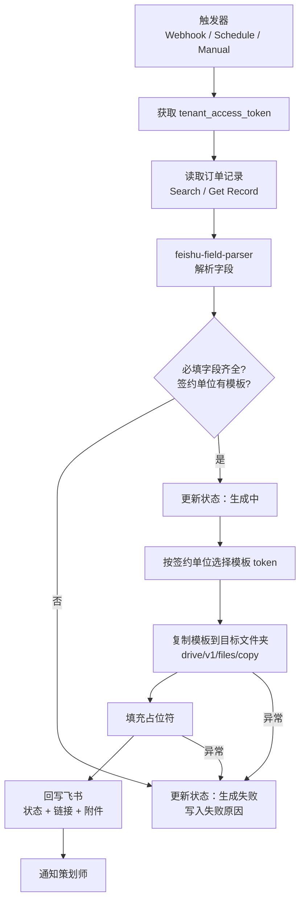
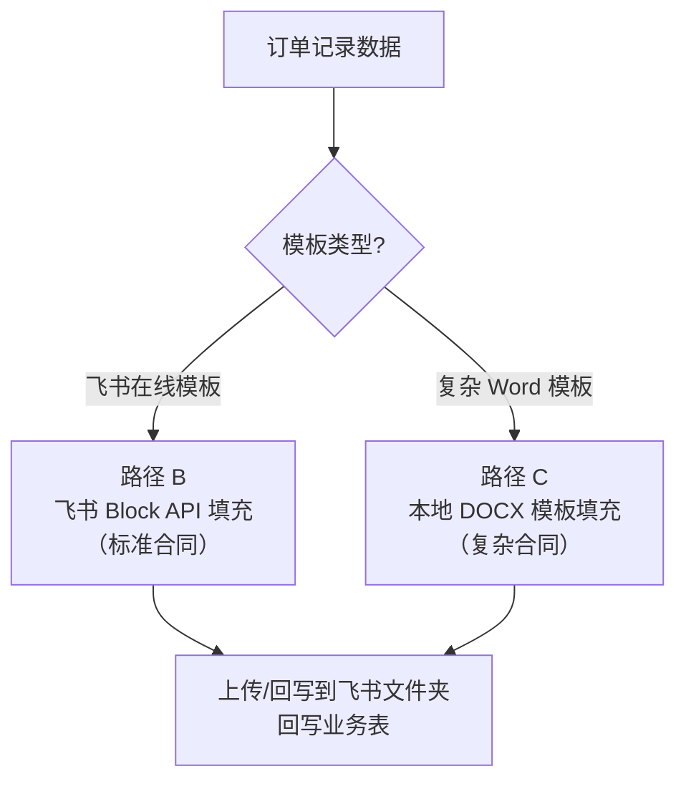

# 合同生成工作流 — 技术路径设计文档

状态：`设计阶段（未开发）`

## 一、背景与定位

### 1.1 业务目标

从飞书多维表格（订单记录表）读取合同所需业务数据，基于飞书云文档中的**合同模板**，在指定云文档文件夹中**生成一份填充好的合同文档**，并将生成结果回写到业务表。

本工作流与现有「合同扫描识别」工作流方向相反：

| 工作流 | 方向 | 状态 |
| --- | --- | --- |
| 合同扫描识别 | 已有 PDF 合同 → 提取字段 → 回写飞书 | 待开发（设计文档已有） |
| **合同生成** | 飞书业务数据 → 填充模板 → 生成云文档 | **本文档** |

### 1.2 项目上下文

当前仓库已具备以下基础设施，合同生成工作流应优先复用：

| 组件 | 作用 | 合同生成中的角色 |
| --- | --- | --- |
| `n8n` | 工作流编排 | 触发、编排、回写 |
| `feishu-listener` | 飞书事件长连接 → Webhook | 监听 `合同生成状态=待生成` |
| `feishu-field-parser` | 多维表格字段解析 | 将 `field_id` 事件转为可读字段名 |
| `pdf-parser` | PDF 解析 | 本场景不直接使用，但服务模式可参考 |

目标数据表：**订单记录** `tbl91gZyDPCLhlva`（`quote_records`）

已有相关字段（来自 `feishu-field-parser/config.yaml`）：

| 字段名 | 类型 | 用途 |
| --- | --- | --- |
| `合同生成状态` | 单选 | 待生成 / 已生成 / 生成失败 / 需重试 |
| `合同` | 附件 | 回写生成的合同文件（或仅存链接） |
| `签约单位` | 单选 | 选择对应合同模板（趣加旅社、趣加文化创意等） |
| `合同价款` | 数字 | 填充合同金额 |
| `执行日期` | 日期 | 填充活动日期 |
| `执行人数` | 关联引用 | 填充人数 |
| `联系人` / `联系方式` / `单位` | 关联引用 | 甲方信息 |
| `客户需求` | 文本 | 活动描述 |
| `订单号` | 自动编号 | 合同文件名、编号 |
| `策划师` | 人员 | 乙方对接人 |

---

## 二、飞书开放平台 API 可行性验证

> 以下结论基于飞书开放平台官方文档（Context7 `/websites/open_feishu_cn_document_server-docs` 及 open.feishu.cn 原文），截至 2026-07。

### 2.1 核心结论

**整体可行**，但飞书**没有**「模板变量一键合并」的原生 API。必须采用「复制模板 → 修改内容」的组合方案。



### 2.2 各环节 API 对照

#### 数据读取（多维表格）

| 能力 | API | 可行性 | 说明 |
| --- | --- | --- | --- |
| 按条件查询记录 | `POST /bitable/v1/apps/{app_token}/tables/{table_id}/records/search` | ✅ | 与发票识别、合同扫描识别一致 |
| 获取单条记录 | `GET /bitable/v1/apps/{app_token}/tables/{table_id}/records/{record_id}` | ✅ | Webhook 触发后补全字段 |
| 更新记录 | `PUT /bitable/v1/apps/{app_token}/tables/{table_id}/records/{record_id}` | ✅ | 回写状态、链接、附件 |
| 字段解析 | `feishu-field-parser /api/parse` | ✅ | 已有服务，减少 n8n Code 节点复杂度 |

#### 模板读取与文档生成（云文档）

| 能力 | API | 可行性 | 说明 |
| --- | --- | --- | --- |
| 基于模板创建文档 | `POST /drive/v1/files/{file_token}/copy` | ✅ | **官方推荐方式**：模板即普通 docx 文档，复制后得到新文档 |
| 创建空白文档 | `POST /docx/v1/documents` | ✅ | 仅支持标题，**不支持带内容创建** |
| 获取文档纯文本 | `GET /docx/v1/documents/{document_id}/raw_content` | ✅ | 只返回纯文本，**不含格式和块 ID** |
| 获取所有文档块 | `GET /docx/v1/documents/{document_id}/blocks` | ✅ | 分页，每页最多 500 块 |
| 获取子块 | `GET /docx/v1/documents/{document_id}/blocks/{block_id}/children` | ✅ | 支持 `with_descendants=true` 遍历整棵树 |
| 批量更新块 | `PATCH /docx/v1/documents/{document_id}/blocks/batch_update` | ✅ | 通过 `update_text_elements` 替换文本内容 |
| 创建子块 | `POST /docx/v1/documents/{document_id}/blocks/{block_id}/children` | ✅ | 追加段落时使用 |
| 导出为 DOCX | `POST /drive/v1/export_tasks` + 轮询 + 下载 | ✅ | 异步，导出文件 10 分钟后删除 |
| 上传文件到云空间 | `POST /drive/v1/files/upload_all` | ✅ | 小文件直传；大文件用分片上传 |

#### 关键限制（必须在设计中考虑）

| 限制项 | 官方说明 | 设计影响 |
| --- | --- | --- |
| 无查找替换 API | 只能通过 Block 操作实现占位符替换 | 需遍历块树或预映射 block_id |
| 复制文件频率 | 5 QPS，10000 次/天，不支持并发 | 批量生成需排队 + 重试 |
| 文档 API 频率 | 约 5 QPS / 应用 | 块遍历 + 批量更新需限速 |
| 复制文件权限 | 需源文件阅读权限 + 目标文件夹编辑权限 | 应用需被加入模板文件夹协作者 |
| 附件回写 | 附件字段需先上传得 `file_token` | 若回写 `[合同]` 附件，需走上传流程 |
| 导出 DOCX 限制 | 文档资源最大 1 GB | 一般合同模板不受影响 |

### 2.3 官方推荐的模板创建流程

飞书开放平台在「创建云文档」文档中明确说明：

> 模板其实也是一篇云文档，可以先通过模板链接获取该模板的 token 作为文件 token，再调用**复制文件**接口创建云文档。

示例：模板链接 `https://{domain}/docx/ke6jdf477ohCVVxzANnc56abcef`  
→ 模板 `file_token` = `ke6jdf477ohCVVxzANnc56abcef`  
→ 调用 copy 接口，指定 `folder_token` 和 `name`

### 2.4 占位符替换的技术现实

飞书新版文档（docx）以 **Block 树** 组织内容。每个文本段落是一个 block，内部有 `text_run.content`。

**没有** `{{甲方名称}}` → `杭州某某公司` 的一键替换接口。可行做法：

1. **块 ID 预映射**：设计模板时记录每个占位符所在 `block_id`，生成时直接 `batch_update`
2. **块树遍历 + 字符串匹配**：遍历所有 `text_run`，将 `{{字段名}}` 替换为实际值
3. **导出 DOCX → python-docx 填充 → 上传**：绕过 Block API，但格式往返有风险

---

## 三、端到端业务流程（目标态）

```text
触发（Webhook / 定时 / 手动）
    ↓
获取飞书 tenant_access_token
    ↓
获取订单记录完整字段（Search / Get Record）
    ↓
feishu-field-parser 解析为可读对象
    ↓
校验必填字段 + 选择签约单位对应模板
    ↓
复制模板到目标文件夹（drive copy）
    ↓
填充占位符（Block 替换 / DOCX 填充）
    ↓
（可选）导出 PDF 存档
    ↓
回写飞书：合同生成状态、文档链接、合同附件
    ↓
（可选）飞书消息通知策划师
```



---

## 四、五条技术路径对比

### 路径 A：纯 n8n + 飞书 Block API

**方案**：n8n HTTP Request 节点直接调用飞书 API，Code 节点实现块树遍历和占位符替换。

```text
n8n Webhook
  → HTTP 获取记录
  → HTTP 复制模板
  → HTTP 获取 blocks（分页循环）
  → Code 遍历 + 构造 batch_update requests
  → HTTP batch_update
  → HTTP 回写记录
```

| 维度 | 评价 |
| --- | --- |
| 开发成本 | 中。无需新服务，但 n8n Code 节点逻辑重 |
| 可维护性 | 低。块遍历、分页、限速、错误处理全在 n8n 里，难测试 |
| 格式保真 | 高。直接在飞书文档内修改，保留原模板排版 |
| 复杂模板支持 | 中。表格单元格、嵌套列表需额外处理 |
| 性能 | 中。受 5 QPS 限制，n8n 循环节点开销大 |
| 与现有架构契合 | 中。偏离 pdf-parser / feishu-field-parser 的服务化模式 |

**优点**

- 不引入新容器/服务
- 全链路可在 n8n UI 中可视化

**缺点**

- n8n Code 节点难以单元测试
- 块树遍历代码量大（预计 200+ 行），维护成本高
- 多签约单位多模板时，配置分散在 n8n 节点中

**适用场景**：模板简单（< 20 个占位符）、合同量少（< 30 份/天）、快速验证 POC。

---

### 路径 B：独立 Python 合同生成服务（推荐）

**方案**：新增 `contract-generator` 服务（模式同 `pdf-parser`、`feishu-field-parser`），封装「复制模板 + 块遍历替换 + 上传/回链」。

```text
n8n Webhook
  → HTTP 获取记录 + feishu-field-parser 解析
  → POST contract-generator:8030/api/generate
       内部：token → copy → traverse blocks → batch_update
  → n8n 拿结果回写飞书
```

| 维度 | 评价 |
| --- | --- |
| 开发成本 | 中高。需新建服务，但逻辑集中 |
| 可维护性 | 高。可单元测试、可复用、可版本管理 |
| 格式保真 | 高。原生 Block API |
| 复杂模板支持 | 高。可扩展表格单元格替换、条件段落 |
| 性能 | 高。服务内统一限速和重试 |
| 与现有架构契合 | **最高**。与现有 Docker Compose 栈一致 |

**优点**

- 与项目现有「n8n 编排 + Python 微服务执行」模式完全一致
- 模板配置可放 `config.yaml`（签约单位 → 模板 token → 占位符映射）
- 可独立测试：`curl -X POST /api/generate -d '{...}'`
- 未来结算单、出团通知书可复用同一服务

**缺点**

- 需维护一个新容器（+1 服务）
- 仍需处理 Block API 复杂性（但集中在 Python 中）

**适用场景**：**生产环境首选**。多签约单位、多模板、需长期维护。

---

### 路径 C：本地 DOCX 模板 + 上传飞书

**方案**：合同模板以 `.docx` 文件存放于服务器（或 `files/templates/`），用 `python-docx` + `docxtpl`（Jinja2 语法）本地填充，再通过 `upload_all` 上传到飞书目标文件夹。

```text
n8n
  → 获取记录数据
  → POST contract-generator /api/generate-docx
       读取本地 template.docx
       docxtpl 渲染 {{甲方}} {{金额}}
       upload_all 到飞书文件夹
  → 回写飞书
```

| 维度 | 评价 |
| --- | --- |
| 开发成本 | 低。docxtpl 生态成熟 |
| 可维护性 | 高。模板即 Word 文件，法务可直接改 |
| 格式保真 | 高。Word 占位符语法成熟 |
| 复杂模板支持 | **最高**。表格行循环、条件块、图片插入 |
| 性能 | 高。本地渲染，仅上传一步走网络 |
| 与现有架构契合 | 高。仍可用 contract-generator 服务 |

**优点**

- `{{甲方名称}}`、`` 等 Jinja2 语法直接可用
- 法务/运营可用 Word 编辑模板，无需理解 Block API
- 不依赖飞书模板在线编辑

**缺点**

- 模板不在飞书云文档中，**不符合「从飞书云文档读取模板」的原始需求**
- 上传后生成的是「上传的 docx」，不是飞书原生 docx 在线文档（可导入但体验不同）
- 若需飞书在线协作编辑，需额外 copy 或转换

**适用场景**：合同格式复杂（多页、多表格、嵌套条款），且团队更熟悉 Word 模板。

---

### 路径 D：飞书模板导出 DOCX → 填充 → 回传

**方案**：从飞书云文档导出 DOCX → python-docx 填充 → 上传回飞书。

```text
copy 模板（保留飞书原生文档）
  +
export_tasks 导出 DOCX
  → docxtpl 填充
  → upload_all 上传
  → （可选）删除 copy 的空壳文档
```

| 维度 | 评价 |
| --- | --- |
| 开发成本 | 高。异步导出 + 轮询 + 填充 + 上传 |
| 可维护性 | 中 |
| 格式保真 | 中。导出/导入可能丢失部分飞书特有格式 |
| 复杂模板支持 | 高 |
| 性能 | 低。多 2-3 个异步 API 步骤 |
| 与现有架构契合 | 中 |

**优点**

- 满足「模板存于飞书云文档」的需求
- 可用 Word 级填充能力

**缺点**

- 链路最长：copy → export → download → fill → upload
- 导出文件 10 分钟过期，时序需严格控制
- 格式往返损耗风险最高
- 比路径 C 复杂，但填充能力与路径 C 相同

**适用场景**：模板必须在飞书维护、且 Block API 无法满足复杂排版时。一般**不推荐**作为首选。

---

### 路径 E：AI 生成合同全文

**方案**：将业务数据和模板全文送入 LLM（DeepSeek 等），由 AI 输出合同 Markdown/文本，再写入飞书文档。

| 维度 | 评价 |
| --- | --- |
| 开发成本 | 低（短期） |
| 可维护性 | 低。输出不稳定 |
| 格式保真 | 低 |
| 法律风险 | **高**。条款可能被 AI 篡改 |
| 与现有架构契合 | 中。项目已有 DeepSeek 节点经验 |

**优点**

- 灵活，可处理非结构化需求

**缺点**

- 合同条款法律风险极高
- 格式不可控，每次生成可能不同
- 无法保证与标准模板一致

**适用场景**：仅作为辅助（如生成「活动描述」段落），**不应**作为合同主体生成方案。

---

### 四路径总览对比表

| 路径 | 模板来源 | 需要新服务 | 格式保真 | 开发量 | 维护性 | 推荐度 |
| --- | --- | --- | --- | --- | --- | --- |
| A 纯 n8n + Block API | 飞书云文档 | 否 | 高 | 中 | 低 | ⭐⭐ POC |
| **B 合同生成服务 + Block API** | **飞书云文档** | **是** | **高** | **中高** | **高** | **⭐⭐⭐⭐⭐ 生产首选** |
| C 本地 DOCX + 上传 | 本地 Word 文件 | 是 | 高 | 低 | 高 | ⭐⭐⭐⭐ 复杂模板 |
| D 导出 DOCX 往返 | 飞书云文档 | 是 | 中 | 高 | 中 | ⭐⭐ 备选 |
| E AI 生成 | 无固定模板 | 否 | 低 | 低 | 低 | ⭐ 不推荐 |

---

## 五、推荐方案与组合策略

### 5.1 推荐：路径 B 为主，路径 C 兜底



**理由**：

1. 满足原始需求：模板存于飞书云文档，通过 copy 生成
2. 契合现有架构：n8n 编排 + Python 微服务
3. 可渐进实施：先用路径 B 跑通简单合同，复杂模板切路径 C
4. 复用已有能力：`feishu-field-parser` 解析字段、`feishu-listener` 触发

### 5.2 若追求最快 POC

可先用**路径 A**（纯 n8n）验证 1-2 个模板、5 个字段的替换链路，确认权限和 copy 流程无误后，再迁移到路径 B。

---

## 六、推荐架构详细设计（路径 B）

### 6.1 服务划分

| 服务 | 新增? | 职责 |
| --- | --- | --- |
| `n8n` | 否 | 触发、取数、调服务、回写、通知 |
| `feishu-listener` | 否 | 监听 `合同生成状态` 变更 |
| `feishu-field-parser` | 否 | 字段 ID → 字段名 |
| `contract-generator` | **是** | 复制模板、填充、返回文档 URL |

### 6.2 contract-generator 建议 API

```http
POST /api/generate
Content-Type: application/json

{
  "tenant_access_token": "t-xxx",          // 或由服务自行获取
  "template_token": "doxcnXXX",            // 模板 file_token
  "folder_token": "fldcnXXX",              // 目标文件夹
  "document_name": "合同-订单号20240708001",
  "placeholders": {
    "甲方名称": "杭州某某科技有限公司",
    "乙方名称": "杭州趣加旅社有限公司",
    "合同价款": "80,000.00",
    "活动日期": "2026/06/25",
    "活动人数": "120",
    "付款方式": "预付50%，活动结束后付尾款"
  },
  "mode": "block_replace"                  // 或 "docx_template"
}
```

响应：

```json
{
  "success": true,
  "document_id": "doxcnNewDocXXX",
  "document_url": "https://feishu.cn/docx/doxcnNewDocXXX",
  "file_token": "doxcnNewDocXXX",
  "replaced_count": 12,
  "warnings": []
}
```

### 6.3 模板配置建议（config.yaml）

```yaml
templates:
  趣加旅社:
    template_token: "doxcnTemplateAAA"
    folder_token: "fldcnOutputFolder"
    placeholders:
      甲方名称: "{{单位}}"
      合同价款: "{{合同价款}}"
      活动日期: "{{执行日期}}"
      活动人数: "{{执行人数}}"
      联系人: "{{联系人}}"
      联系方式: "{{联系方式}}"
  趣加文化创意:
    template_token: "doxcnTemplateBBB"
    folder_token: "fldcnOutputFolder"
    placeholders: { ... }
```

### 6.4 占位符替换算法（Block 模式）

```python
# 伪代码 — 生产实现在 contract-generator 服务中
def fill_document(token, document_id, placeholders):
    blocks = paginate_get_all_blocks(document_id)
    requests = []
    for block in blocks:
        for element in block.get("text", {}).get("elements", []):
            text_run = element.get("text_run")
            if not text_run:
                continue
            content = text_run["content"]
            new_content = content
            for key, value in placeholders.items():
                new_content = new_content.replace(f"{{{{{key}}}}}", str(value))
            if new_content != content:
                requests.append({
                    "block_id": block["block_id"],
                    "update_text_elements": {
                        "elements": [{"text_run": {"content": new_content}}]
                    }
                })
    # 分批 batch_update，每批 ≤ 20 个 request，间隔 ≥ 200ms
    batch_update(document_id, requests)
```

**注意**：若一个 block 内有多个 `text_run`（不同样式），需合并处理或按 element 分别更新。表格单元格需递归进入 `table` block 的子块。

### 6.5 n8n 工作流节点清单（草案）

| 序号 | 节点类型 | 节点名称 | 作用 |
| --- | --- | --- | --- |
| 1 | Webhook / Schedule / Manual | 触发器 | Webhook 优先，Schedule 兜底 |
| 2 | HTTP Request | 获取飞书 Token | `tenant_access_token` |
| 3 | HTTP Request | 查询待生成合同 | `合同生成状态=待生成` |
| 4 | Split In Batches | 逐单处理 | 避免并发触发 copy 限流 |
| 5 | HTTP Request | 更新状态_生成中 | 防重复 |
| 6 | HTTP Request | 获取记录详情 | Get Record 补全关联字段 |
| 7 | HTTP Request | 调用 field-parser | 解析为可读对象 |
| 8 | Code | 校验 + 选模板 | 检查必填项，映射 placeholders |
| 9 | IF | 可生成? | 缺字段则标记失败 |
| 10 | HTTP Request | 调用 contract-generator | `POST /api/generate` |
| 11 | Code | 准备回写数据 | 构造 fields 对象 |
| 12 | HTTP Request | 回写飞书记录 | 状态 + 超链接 + 附件 |
| 13 | HTTP Request | 通知策划师 | 可选，飞书消息 API |

### 6.6 触发方式

**推荐：Webhook 实时触发**（与发票识别、报价生成一致）

在 `feishu-listener/config.yaml` 新增路由：

```yaml
- name: contract-generation
  enabled: true
  dispatch_enabled: true
  event_type: drive.file.bitable_record_changed_v1
  app_token: ${FEISHU_BASE_ID}
  table_id: tbl91gZyDPCLhlva
  field_conditions:
    - field_id: fldtbIxVRj          # 合同生成状态
      equals: optDsTqtUW            # 待生成
  n8n_webhook_url: http://n8n:5678/webhook/feishu/contract-generate
```

**兜底：Schedule 定时扫描**

每 15-30 分钟 Search Records，`合同生成状态=待生成`，处理 Webhook 漏发的情况。

---

## 七、飞书应用权限清单

在飞书开放平台 → 应用 → 权限管理中开通：

| 权限 | 用途 | 必需 |
| --- | --- | --- |
| `bitable:app` | 读取/更新多维表格记录 | ✅ |
| `docs:document:copy` | 复制云文档模板 | ✅ |
| `docx:document` | 读取和编辑新版文档 | ✅ |
| `drive:drive` | 管理云空间文件 | ✅ |
| `drive:file:upload` | 上传合同文件 | 路径 C 需要 |
| `docs:document:export` | 导出 DOCX | 路径 D 需要 |
| `im:message` | 发送生成通知 | 可选 |

**协作授权**（非 API 权限，但缺一不可）：

1. 将自建应用机器人加入**模板文件夹**（阅读权限）
2. 将机器人加入**输出文件夹**（编辑权限）
3. 将机器人加入**多维表格**（编辑权限）

---

## 八、字段映射参考

### 8.1 订单记录 → 合同占位符

| 合同占位符 | 来源字段 | 转换说明 |
| --- | --- | --- |
| `{{甲方名称}}` | `单位`（关联客户表） | 通过 field-parser 解析关联文本 |
| `{{甲方联系人}}` | `联系人` | 关联字段 |
| `{{甲方电话}}` | `联系方式` | 关联字段 |
| `{{乙方名称}}` | `签约单位` | 单选映射为公司全称 |
| `{{合同价款}}` | `合同价款` | 格式化为 `¥80,000.00` |
| `{{活动日期}}` | `执行日期` | 按 `yyyy/MM/dd` 格式化 |
| `{{活动人数}}` | `执行人数` | 关联执行表人数 |
| `{{活动描述}}` | `客户需求` | 多行文本 |
| `{{订单号}}` | `订单号` | 自动编号 |
| `{{策划师}}` | `策划师` | 人员姓名 |
| `{{签订日期}}` | — | 生成当日日期 |

### 8.2 签约单位 → 模板映射

| 签约单位 | 建议模板文件名 | 说明 |
| --- | --- | --- |
| 趣加旅社 | `合同模板-趣加旅社.docx` | 主力模板 |
| 趣加文化创意 | `合同模板-趣加文化创意.docx` | |
| 趣顽 | `合同模板-趣顽.docx` | |
| 旅苑国际旅行社有限公司第一分公司 | `合同模板-旅苑.docx` | |
| 趣加体育文化 | `合同模板-趣加体育.docx` | |
| 趣加管理咨询 | `合同模板-趣加管理咨询.docx` | |

模板 token 不写在表中，统一维护在 `contract-generator/config.yaml`，便于版本管理。

### 8.3 回写字段

| 字段 | 回写内容 |
| --- | --- |
| `合同生成状态` | 已生成 / 生成失败 / 需重试 |
| `合同` | 上传生成的合同文件（附件），或仅写链接 |
| 建议新增 `合同文档链接` | 超链接类型，存放 `document_url` |
| 建议新增 `合同生成日志` | 多行文本，记录生成时间和失败原因 |

---

## 九、模板设计规范（运营侧）

为确保 Block API 路径可靠，合同模板需遵守：

1. **占位符格式统一**：`{{字段名}}`，与字段映射表一致
2. **每个占位符独占一个 text_run**：避免同一 block 内多个占位符夹在固定文字中间（增加替换复杂度）
3. **表格内占位符**：使用独立单元格，不跨单元格
4. **模板版本管理**：在模板标题注明版本号，如 `合同模板-趣加旅社-v2`
5. **模板 token 更新流程**：模板大改后，更新 `config.yaml` 中的 `template_token`

---

## 十、风险与应对

| 风险 | 影响 | 应对 |
| --- | --- | --- |
| copy 接口 5 QPS 限流 | 批量生成失败 | Split In Batches + 指数退避重试 |
| 占位符跨多个 text_run | 替换不完整 | 模板规范 + 生成前校验 |
| 关联字段为空 | 合同信息缺失 | 生成前必填校验，失败写 `生成失败` |
| 应用无文件夹权限 | copy 返回 1061004 | 部署时检查机器人协作者 |
| Webhook 漏发 | 合同未生成 | Schedule 定时兜底扫描 |
| 并发生成同一订单 | 重复合同 | 生成前检查 `合同生成状态`，先改「生成中」 |
| 合同法律效力 | 条款错误 | 不使用 AI 生成正文；模板由法务审定 |

---

## 十一、实施路线图

### Phase 0：准备（1-2 天）

- [ ] 在飞书云文档创建 1 个测试模板，含 5-10 个 `{{占位符}}`
- [ ] 记录模板 `file_token`、输出文件夹 `folder_token`
- [ ] 确认应用权限和文件夹协作者
- [ ] 在订单表确认 `合同生成状态` 字段可用

### Phase 1：POC 验证（2-3 天）

- [ ] 用 n8n Manual Trigger + HTTP 节点手动调用 copy + batch_update
- [ ] 验证 1 条订单记录可生成 1 份合同
- [ ] 确认回写 `合同生成状态` 和文档链接

### Phase 2：服务化（3-5 天）

- [ ] 创建 `contract-generator` 服务（FastAPI + Docker）
- [ ] 实现 `POST /api/generate`（block_replace 模式）
- [ ] 编写 `config.yaml` 模板映射
- [ ] 加入 `compose.yaml`

### Phase 3：工作流集成（2-3 天）

- [ ] n8n 工作流编排（参考发票识别模式）
- [ ] `feishu-listener` 新增路由
- [ ] Schedule 兜底任务
- [ ] 端到端测试 3 种签约单位模板

### Phase 4：生产加固（2-3 天）

- [ ] 错误处理与重试（需重试状态）
- [ ] 日志与监控
- [ ] 策划师通知
- [ ] 模板版本管理流程文档化

---

## 十二、与现有工作流的关系

```text
                    飞书订单表 tbl91gZyDPCLhlva
                              │
          ┌───────────────────┼───────────────────┐
          ▼                   ▼                   ▼
    报价生成-测试        合同生成（本文档）      合同扫描识别
    提取报价基础数据      数据→模板→云文档       云文档/PDF→识别字段
          │                   │                   │
          ▼                   ▼                   ▼
    （待完善输出）        contract-generator      pdf-parser
```

| 参考文档 / 文件 | 可复用的模式 |
| --- | --- |
| `发票识别工作流.md` | Webhook 触发、状态机、Split In Batches |
| `合同扫描识别工作流.md` | 订单表字段、飞书 API 路径 |
| `feishu-field-parser` | 字段解析、config.yaml 配置风格 |
| `files/quote-generation-test.workflow.json` | 报价事件解析 Code 节点 |
| `feishu-listener/config.yaml` | 路由配置、field_conditions |

---

## 十三、附录：关键 API 速查

### 复制模板

```http
POST https://open.feishu.cn/open-apis/drive/v1/files/{template_token}/copy
Authorization: Bearer {tenant_access_token}
Content-Type: application/json

{
  "name": "合同-订单号20240708001",
  "type": "docx",
  "folder_token": "{output_folder_token}"
}
```

### 获取文档块

```http
GET https://open.feishu.cn/open-apis/docx/v1/documents/{document_id}/blocks?page_size=500&document_revision_id=-1
Authorization: Bearer {tenant_access_token}
```

### 批量更新块

```http
PATCH https://open.feishu.cn/open-apis/docx/v1/documents/{document_id}/blocks/batch_update
Authorization: Bearer {tenant_access_token}
Content-Type: application/json

{
  "requests": [
    {
      "block_id": "doxcnXXX",
      "update_text_elements": {
        "elements": [
          { "text_run": { "content": "杭州某某科技有限公司" } }
        ]
      }
    }
  ]
}
```

### 查询待生成订单

```http
POST https://open.feishu.cn/open-apis/bitable/v1/apps/{app_token}/tables/tbl91gZyDPCLhlva/records/search
Authorization: Bearer {tenant_access_token}
Content-Type: application/json

{
  "field_names": [
    "订单号", "签约单位", "合同价款", "执行日期",
    "执行人数", "客户需求", "策划师", "合同生成状态"
  ],
  "filter": {
    "conjunction": "and",
    "conditions": [
      {
        "field_name": "合同生成状态",
        "operator": "is",
        "value": ["待生成"]
      }
    ]
  },
  "page_size": 20
}
```

### 回写生成结果

```http
PUT https://open.feishu.cn/open-apis/bitable/v1/apps/{app_token}/tables/tbl91gZyDPCLhlva/records/{record_id}
Authorization: Bearer {tenant_access_token}
Content-Type: application/json

{
  "fields": {
    "合同生成状态": "已生成",
    "合同文档链接": {
      "text": "查看合同",
      "link": "https://feishu.cn/docx/doxcnNewDocXXX"
    }
  }
}
```

---

## 十四、结论

1. **技术可行**：飞书开放平台 API 足以支撑「读表 → 读模板 → 生成文档 → 回写」全链路，但不存在原生模板合并 API，必须通过**复制 + 内容替换**实现。
2. **推荐路径**：**路径 B（contract-generator 服务 + Block API）** 最适合当前项目架构；复杂模板可降级到**路径 C（本地 DOCX）**。
3. **不推荐**：路径 E（AI 生成合同正文）因法律风险和格式不可控，仅可作为辅助。
4. **下一步**：按第十一章 Phase 0-1 做 POC，验证模板 copy 和 5 个字段替换后，再决定是否创建 `contract-generator` 服务。

---

## 参考文档

- [飞书：复制文件](https://open.feishu.cn/document/server-docs/docs/drive-v1/file/copy)
- [飞书：创建云文档](https://open.feishu.cn/document/docs/drive-v1/file/create-cloud-document)
- [飞书：文档概述（docx-v1）](https://open.feishu.cn/document/server-docs/docs/docs/docx-v1/docx-overview)
- [飞书：批量更新块](https://open.feishu.cn/document/server-docs/docs/docs/docx-v1/document-block/batch_update)
- [飞书：搜索记录](https://open.feishu.cn/document/server-docs/docs/bitable-v1/app-table-record/search)
- [飞书：导出任务](https://open.feishu.cn/document/server-docs/docs/drive-v1/export_task/create)
