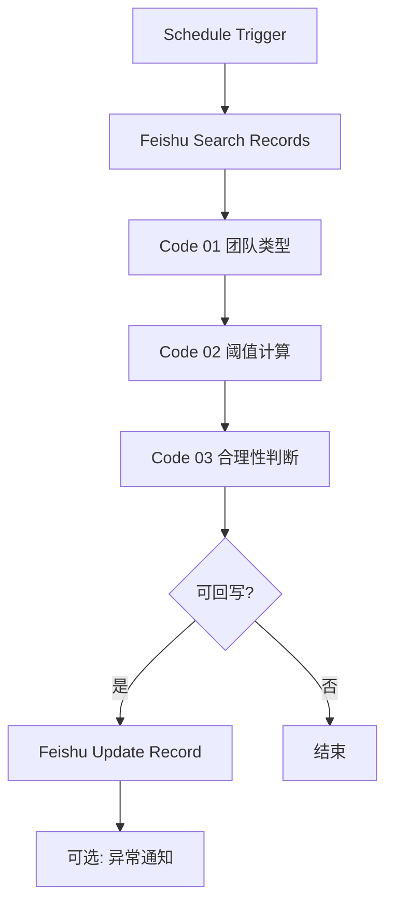

# 订单收支合理性核验工作流

状态：`待开发`

## 一、背景与定位

订单收支预警算法已从飞书单字段公式迁移为 **n8n 外置核验**。原因：

- V2 算法需 20+ 中间字段，飞书公式体量过大、维护成本高、计算慢。
- n8n 可用 JavaScript 直接复用 [[数据分析/order-threshold-calculator.js]] 口径。
- 核验结果回写飞书 `[检查备注]` 或专用核验状态字段，不影响业务表公式性能。

所属模块：`构建维护飞书业务表plus/外置n8n工作流/`（财务巡检 / 数据质量巡检）

业务口径：

- [[数据分析/订单应收应支合理性判断规则]]
- [[数据分析/合理收支区间list]]
- [[构建维护飞书业务表plus/公式汇总/订单收支情况核验公式]]（V2 设计参考，不再作为主实现）

目标数据表：订单表 `tbl91gZyDPCLhlva`

---

## 二、工作流总览

```text
触发器（Schedule / Manual）
    ↓
Feishu Official · Search Records（查询待检查订单）
    ↓
[可选] Split Out / Item Lists（若上游返回 items 数组）
    ↓
Code · 01 字段归一化 + 团队类型
    ↓
Code · 02 预警阈值计算（纯玩基础 + 活动参数）
    ↓
Code · 03 订单合理性判断
    ↓
IF · 是否跳过（字段异常 / 非核验订单类型）
    ↓
Feishu Official · Update Record（回写检查备注 / 核验状态）
    ↓
[可选] Feishu Message / 机器人通知异常单
```



---

## 三、n8n 节点清单

| 序号 | 节点类型 | 节点名称 | 作用 |
| --- | --- | --- | --- |
| 1 | Schedule Trigger / Manual Trigger | 定时或手动触发 | 建议每日 1-2 次批量核验 |
| 2 | Feishu Official · **Search Records** | 查询待检查订单 | 筛选 `检查备注` 含「待检查」的已成交订单 |
| 3 | Code | **01 字段归一化 + 团队类型** | 解析飞书字段结构，计算团队类型与基础指标 |
| 4 | Code | **02 预警阈值计算** | 加载纯玩/活动参数，输出预警上下限 |
| 5 | Code | **03 订单合理性判断** | 对比实际值与阈值，输出核验状态 |
| 6 | IF | 是否回写 | 跳过「跳过核验」类订单（返利、半日等） |
| 7 | Feishu Official · **Update Record** | 回写飞书 | 更新 `检查备注`、可选 `收支核验状态` |
| 8 | [可选] Feishu Message | 异常提醒 | 仅 `需复核` / `需备注` 时通知策划师 |

---

## 四、Feishu Search Records 配置要点

### 4.1 查询条件（建议）

- 数据表：`tbl91gZyDPCLhlva`
- 筛选：`检查备注` 包含 `待检查`
- 可选追加：`成交状态` = `已成交`
- 分页：`page_size` 50，循环直到 `has_more = false`

### 4.2 需拉取的字段

| 飞书字段 | 用途 |
| --- | --- |
| `record_id` | 回写定位 |
| `订单号` | 日志 / 通知 |
| `天数` | 主天数口径；缺失时用 `出行天数` |
| `出行天数` | 天数 fallback |
| `订单类型` | 纯玩 / 需教练 / 返利等 |
| `执行人数` | 团队类型、人均计算 |
| `合计应收` | 人均应收、毛利润率 |
| `合计应支` | 人均毛利、毛利润率 |
| `合计已收` | 收付进度（二期） |
| `合计支出` | 收付进度（二期） |
| `检查备注` | 回写目标 |
| `策划师` | 可选通知对象 |

### 4.3 飞书字段结构说明

查询结果中字段存在多种结构，Code 01 需统一解析：

```text
数字字段：{ "type": 2, "value": [120] }  → 取 value[0]
文本字段：{ "type": 1, "value": [{ "text": "xxx" }] }  → 取 value[0].text
纯字符串："两日"、"纯玩"
单选数组：["上海"]
人员字段：[{ "id": "ou_xxx", "name": "阿铭" }]
缺失字段：undefined / {} / value 为空数组
```

样本中的典型情况：

- `执行人数` 为 `{ type: 2, value: [120] }` → 120
- `天数` 可能缺失，仅有 `出行天数: "1日"` → 归一化为 `一日`
- `订单类型` 可能缺失 → 字段异常
- `半日` → V2 已废除，标记为跳过或字段异常
- `返利` → 不在核验范围，标记 `跳过核验｜返利单`

---

## 五、节点间数据契约

### 5.1 Code 01 输出

```json
{
  "record_id": "recvj7T1jOgQ2Z",
  "orderNo": "26051529",
  "daysRaw": "两日",
  "daysNormalized": "二日",
  "orderType": "纯玩",
  "executors": 120,
  "teamType": "大团",
  "revenueGroup": "大团",
  "totalRevenue": 10000,
  "totalPayable": 10000,
  "revenuePerCapita": 83.33,
  "grossProfitPerCapita": 0,
  "grossMargin": 0,
  "fieldStatus": "正常",
  "fieldErrors": [],
  "skipCheck": false,
  "skipReason": ""
}
```

### 5.2 Code 02 输出（在 01 基础上追加）

```json
{
  "thresholdScope": "纯玩",
  "purePlay": {
    "revenueFloor": 330,
    "marginFloor": 0.15,
    "marginCeiling": 0.5,
    "grossProfitFloor": 49.5
  },
  "coach": null
}
```

需教练示例（大团 · 二日）：

```json
{
  "thresholdScope": "需教练",
  "purePlay": {
    "revenueFloor": 330,
    "marginFloor": 0.15,
    "marginCeiling": 0.5,
    "grossProfitFloor": 49.5
  },
  "coach": {
    "activityRevenueIncrement": 60,
    "activityMarginFloor": 0.35,
    "activityMarginCeiling": 0.8,
    "revenueFloor": 390,
    "grossProfitFloor": 70.5,
    "grossProfitCeiling": 97.5,
    "marginFloor": 0.1808,
    "marginCeiling": 0.25,
    "marginIncrementFloor": 0.0308,
    "marginIncrementCeiling": 0.10
  }
}
```

### 5.3 Code 03 输出（最终判断）

```json
{
  "checkStatus": "价格偏低需复核",
  "checkRemark": "价格偏低需复核｜人均应收83<下限330",
  "signals": ["价格偏低需复核"],
  "diagnostics": {
    "activityRevenueIncrement": null,
    "activityGrossMargin": null,
    "marginIncrement": null
  }
}
```

---

## 六、Code 节点实现（可直接粘贴 n8n）

> Mode：`Run Once for All Items`  
> 算法参数与 [[数据分析/order-threshold-calculator.js]] 保持一致。

### 6.1 Code 01 · 字段归一化 + 团队类型

```javascript
// ========== 工具函数 ==========
function pickNumber(field) {
  if (field == null) return null;
  if (typeof field === 'number' && !Number.isNaN(field)) return field;
  if (typeof field === 'string' && field.trim() !== '') {
    const n = Number(field);
    return Number.isFinite(n) ? n : null;
  }
  if (typeof field === 'object' && Array.isArray(field.value) && field.value.length) {
    const n = Number(field.value[0]);
    return Number.isFinite(n) ? n : null;
  }
  return null;
}

function pickText(field) {
  if (field == null) return '';
  if (typeof field === 'string') return field.trim();
  if (typeof field === 'number') return String(field);
  if (Array.isArray(field)) return pickText(field[0]);
  if (typeof field === 'object') {
    if (Array.isArray(field.value) && field.value.length) {
      const v = field.value[0];
      if (typeof v === 'string') return v.trim();
      if (v && typeof v.text === 'string') return v.text.trim();
    }
    if (typeof field.text === 'string') return field.text.trim();
  }
  return '';
}

function normalizeDays(rawDays, travelDays) {
  const raw = pickText(rawDays) || pickText(travelDays);
  if (!raw) return { raw: '', normalized: '', error: '缺少天数字段' };
  const map = {
    '一日': '一日', '1日': '一日',
    '二日': '二日', '2日': '二日', '两日': '二日',
    '三日': '三日及以上', '多日': '三日及以上',
    '3日': '三日及以上',
  };
  if (raw === '半日') return { raw, normalized: '', error: '半日已废除，需人工处理' };
  const normalized = map[raw];
  if (!normalized) return { raw, normalized: '', error: `无法识别天数：${raw}` };
  return { raw, normalized, error: '' };
}

function resolveTeamType(executors) {
  if (!Number.isFinite(executors) || executors <= 0) return '';
  if (executors <= 15) return '小团';
  if (executors <= 30) return '标准团';
  if (executors <= 60) return '中团';
  return '大团';
}

function resolveRevenueGroup(teamType) {
  if (teamType === '小团' || teamType === '标准团') return '小团/标准团';
  if (teamType === '中团') return '中团';
  if (teamType === '大团') return '大团';
  return '';
}

function flattenRecords(items) {
  const records = [];
  for (const item of items) {
    const j = item.json;
    if (j.data?.items && Array.isArray(j.data.items)) {
      records.push(...j.data.items);
    } else if (j.record_id && j.fields) {
      records.push(j);
    } else if (j.fields) {
      records.push({ record_id: j.record_id || pickText(j.fields['记录 ID']), fields: j.fields });
    }
  }
  return records;
}

// ========== 主逻辑 ==========
const records = flattenRecords($input.all());
const SKIP_ORDER_TYPES = new Set(['返利']);

return records.map((record) => {
  const f = record.fields || {};
  const orderType = pickText(f['订单类型']);
  const daysInfo = normalizeDays(f['天数'], f['出行天数']);
  const executors = pickNumber(f['执行人数']);
  const totalRevenue = pickNumber(f['合计应收']) ?? 0;
  const totalPayable = pickNumber(f['合计应支']) ?? 0;
  const teamType = resolveTeamType(executors);
  const revenueGroup = resolveRevenueGroup(teamType);

  const fieldErrors = [];
  if (SKIP_ORDER_TYPES.has(orderType)) {
    return {
      json: {
        record_id: record.record_id,
        orderNo: pickText(f['订单号']),
        orderType,
        skipCheck: true,
        skipReason: `跳过核验｜${orderType}单`,
        fieldStatus: '跳过',
        fieldErrors: [],
      },
    };
  }

  if (!orderType || !['纯玩', '需教练'].includes(orderType)) {
    fieldErrors.push('订单类型缺失或不在核验范围');
  }
  if (daysInfo.error) fieldErrors.push(daysInfo.error);
  if (!executors) fieldErrors.push('执行人数缺失或无效');
  if (totalRevenue == null) fieldErrors.push('合计应收缺失');

  const revenuePerCapita = executors > 0 ? totalRevenue / executors : 0;
  const grossProfitPerCapita = executors > 0 ? (totalRevenue - totalPayable) / executors : 0;
  const grossMargin = totalRevenue > 0 ? (totalRevenue - totalPayable) / totalRevenue : 0;

  return {
    json: {
      record_id: record.record_id,
      orderNo: pickText(f['订单号']),
      daysRaw: daysInfo.raw,
      daysNormalized: daysInfo.normalized,
      orderType,
      executors,
      teamType,
      revenueGroup,
      totalRevenue,
      totalPayable,
      totalReceived: pickNumber(f['合计已收']) ?? 0,
      totalSpent: pickNumber(f['合计支出']) ?? 0,
      revenuePerCapita: Math.round(revenuePerCapita * 100) / 100,
      grossProfitPerCapita: Math.round(grossProfitPerCapita * 100) / 100,
      grossMargin: Math.round(grossMargin * 10000) / 10000,
      fieldStatus: fieldErrors.length ? '字段异常' : '正常',
      fieldErrors,
      skipCheck: false,
      skipReason: '',
    },
  };
});
```

### 6.2 Code 02 · 预警阈值计算

```javascript
const PURE_PLAY_REVENUE = {
  '一日': { '小团/标准团': 130, '中团': 120, '大团': 110 },
  '二日': { '小团/标准团': 370, '中团': 340, '大团': 330 },
  '三日及以上': { '小团/标准团': 1100, '中团': 1000, '大团': 900 },
};

const PURE_PLAY_MARGIN_FLOOR = {
  小团: 0.2,
  标准团: 0.2,
  中团: 0.18,
  大团: 0.15,
};

const PURE_PLAY_MARGIN_CEILING = 0.5;

const COACH_ACTIVITY = {
  小团: { revenueIncrement: 80, marginFloor: 0.5, marginCeiling: 0.8 },
  标准团: { revenueIncrement: 80, marginFloor: 0.45, marginCeiling: 0.8 },
  中团: { revenueIncrement: 70, marginFloor: 0.4, marginCeiling: 0.8 },
  大团: { revenueIncrement: 60, marginFloor: 0.35, marginCeiling: 0.8 },
};

function round(value, digits = 4) {
  const f = 10 ** digits;
  return Math.round(value * f) / f;
}

return $input.all().map((item) => {
  const data = { ...item.json };

  if (data.skipCheck) {
    return { json: { ...data, thresholdScope: '跳过', purePlay: null, coach: null } };
  }

  if (data.fieldStatus !== '正常') {
    return { json: { ...data, thresholdScope: '字段异常', purePlay: null, coach: null } };
  }

  const days = data.daysNormalized;
  const group = data.revenueGroup;
  const teamType = data.teamType;

  const revenueFloor = PURE_PLAY_REVENUE[days]?.[group];
  const marginFloor = PURE_PLAY_MARGIN_FLOOR[teamType];

  if (revenueFloor == null || marginFloor == null) {
    data.fieldStatus = '字段异常';
    data.fieldErrors = [...(data.fieldErrors || []), '无法匹配预警阈值'];
    return { json: { ...data, thresholdScope: '字段异常', purePlay: null, coach: null } };
  }

  const grossProfitFloor = revenueFloor * marginFloor;
  const purePlay = {
    revenueFloor,
    marginFloor,
    marginCeiling: PURE_PLAY_MARGIN_CEILING,
    grossProfitFloor: round(grossProfitFloor, 2),
  };

  let coach = null;
  let thresholdScope = '纯玩';

  if (data.orderType === '需教练') {
    const act = COACH_ACTIVITY[teamType];
    const coachRevenueFloor = revenueFloor + act.revenueIncrement;
    const coachGrossProfitFloor = grossProfitFloor + act.revenueIncrement * act.marginFloor;
    const coachGrossProfitCeiling = grossProfitFloor + act.revenueIncrement * act.marginCeiling;
    const coachMarginFloor = coachGrossProfitFloor / coachRevenueFloor;
    const coachMarginCeiling = coachGrossProfitCeiling / coachRevenueFloor;

    coach = {
      activityRevenueIncrement: act.revenueIncrement,
      activityMarginFloor: act.marginFloor,
      activityMarginCeiling: act.marginCeiling,
      revenueFloor: coachRevenueFloor,
      grossProfitFloor: round(coachGrossProfitFloor, 2),
      grossProfitCeiling: round(coachGrossProfitCeiling, 2),
      marginFloor: round(coachMarginFloor, 4),
      marginCeiling: round(coachMarginCeiling, 4),
      marginIncrementFloor: round(coachMarginFloor - marginFloor, 4),
      marginIncrementCeiling: round(coachMarginCeiling - marginFloor, 4),
    };
    thresholdScope = '需教练';
  }

  return {
    json: {
      ...data,
      thresholdScope,
      purePlay,
      coach,
    },
  };
});
```

### 6.3 Code 03 · 订单合理性判断

```javascript
function round(v, n) {
  const f = 10 ** n;
  return Math.round(v * f) / f;
}

function buildRemark(status, detail) {
  if (!detail) return status;
  return `${status}｜${detail}`;
}

return $input.all().map((item) => {
  const d = item.json;

  if (d.skipCheck) {
    return {
      json: {
        ...d,
        checkStatus: d.skipReason,
        checkRemark: d.skipReason,
        signals: [],
      },
    };
  }

  if (d.fieldStatus !== '正常') {
    const msg = `字段异常｜${(d.fieldErrors || []).join('；')}`;
    return {
      json: {
        ...d,
        checkStatus: '字段异常',
        checkRemark: msg,
        signals: ['字段异常'],
      },
    };
  }

  const signals = [];
  const pp = d.purePlay;
  let detail = '';

  // 价格偏低（人均应收）
  const revenueFloor = d.orderType === '需教练' ? d.coach.revenueFloor : pp.revenueFloor;
  if (d.revenuePerCapita < pp.revenueFloor) {
    signals.push('价格偏低需复核');
    detail = `人均应收${d.revenuePerCapita}<纯玩下限${pp.revenueFloor}`;
  }

  // 毛利率判断
  if (d.orderType === '纯玩') {
    if (d.grossMargin < pp.marginFloor) {
      signals.push('毛利率偏低需复核');
      detail = detail || `毛利率${(d.grossMargin * 100).toFixed(1)}%<下限${(pp.marginFloor * 100).toFixed(0)}%`;
    }
    if (d.grossMargin > pp.marginCeiling) {
      signals.push('纯玩毛利率偏高需备注');
      detail = detail || `毛利率${(d.grossMargin * 100).toFixed(1)}%>上限50%`;
    }
  }

  if (d.orderType === '需教练') {
    const c = d.coach;
    const activityRevenueIncrement = d.revenuePerCapita - pp.revenueFloor;
    const activityGrossProfitIncrement = d.grossProfitPerCapita - pp.grossProfitFloor;
    const activityGrossMargin =
      activityRevenueIncrement > 0
        ? activityGrossProfitIncrement / activityRevenueIncrement
        : null;

    if (activityRevenueIncrement <= 0) {
      signals.push('活动收入不足需复核');
      detail = detail || '活动人均应收增量<=0';
    } else if (d.grossMargin < c.marginFloor) {
      signals.push('需教练毛利率偏低需复核');
      detail =
        detail ||
        `整体毛利率${(d.grossMargin * 100).toFixed(1)}%<下限${(c.marginFloor * 100).toFixed(1)}%`;
    } else if (d.grossMargin > c.marginCeiling) {
      signals.push('需教练毛利率偏高需备注');
      detail =
        detail ||
        `整体毛利率${(d.grossMargin * 100).toFixed(1)}%>上限${(c.marginCeiling * 100).toFixed(1)}%`;
    }

    d.diagnostics = {
      activityRevenueIncrement: round(activityRevenueIncrement, 2),
      activityGrossProfitIncrement: round(activityGrossProfitIncrement, 2),
      activityGrossMargin: activityGrossMargin == null ? null : round(activityGrossMargin, 4),
      marginIncrement: round(d.grossMargin - pp.marginFloor, 4),
    };
  }

  const checkStatus = signals.length ? signals[0] : '正常';
  const checkRemark = signals.length ? buildRemark(checkStatus, detail) : '正常';

  return {
    json: {
      ...d,
      checkStatus,
      checkRemark,
      signals,
    },
  };
});
```

---

## 七、回写节点配置

### 7.1 Feishu Update Record

- `record_id`：`{{ $json.record_id }}`
- `检查备注`：写入 `{{ $json.checkRemark }}`
- 可选新增字段 `收支核验状态`：写入 `{{ $json.checkStatus }}`

### 7.2 IF 节点条件

仅在以下情况回写：

- `skipCheck === false`
- `checkStatus` 不为空

跳过回写（仅日志）：

- `跳过核验｜返利单`
- 测试模式可开启 dry-run 开关

---

## 八、样本订单预期结果（来自查询快照）

| 订单号 | 类型 | 人数 | 天数 | 人均应收 | 预期状态 | 说明 |
| --- | --- | --- | --- | --- | --- | --- |
| 26051529 | 纯玩 | 120 | 二日 | 83.33 | 价格偏低需复核 | 大团二日下限 330 |
| 26052431 | 返利 | 20 | 一日 | 31.25 | 跳过核验 | 非核验类型 |
| 26053626 | 需教练 | 缺 | 多日 | - | 字段异常 | 无执行人数 |
| 26055058 | 纯玩 | 38 | 二日 | 709.47 | 正常 | 中团二日应收够 |
| 26055230 | 需教练 | 60 | 二日 | 942.55 | 正常或偏高 | 中团需教练二日 |
| 26055551 | 纯玩 | 100 | 三日 | 0 | 字段异常/价格异常 | 合计应收为 0 |
| 26065719 | 纯玩 | 缺 | 缺 | - | 字段异常 | 缺天数、执行人数 |
| 26066109 | 纯玩 | 50 | 半日 | 109.84 | 字段异常 | 半日已废除 |

> 上线前用 [[数据分析/order-threshold-calculator.js]] 批量跑一遍样本做对照。

---

## 九、后续生成工作流 Checklist

- [ ] 在 n8n 新建工作流 `订单收支合理性核验`
- [ ] 配置 Feishu OAuth，确认订单表权限
- [ ] 粘贴三个 Code 节点代码
- [ ] 用用户提供的 25 条样本做 Manual 测试
- [ ] 确认回写字段格式（`检查备注` 为文本还是富文本）
- [ ] 开启 Schedule（建议每日 08:00）
- [ ] 状态改为 `待验证`，业务抽检 1 周
- [ ] 同步更新 [[工作计划]] 与 [[订单收支情况核验公式]]

---

## 十、与算法源码的关系

| 层级 | 文件 | 作用 |
| --- | --- | --- |
| 业务口径 | `数据分析/合理收支区间list.md` | 参数说明 |
| 规则文档 | `数据分析/订单应收应支合理性判断规则.md` | 判断逻辑 |
| 本地演算 | `数据分析/order-threshold-calculator.js` | 沙盒对照、参数变更验证 |
| n8n 实现 | 本文 Code 02 / 03 | 生产环境运行 |
| 飞书公式 | `订单收支情况核验公式.md` V2 | 设计参考，**不再作为主实现** |

修改阈值时：先改 `order-threshold-calculator.js` 验证，再同步 Code 02 常量块。
