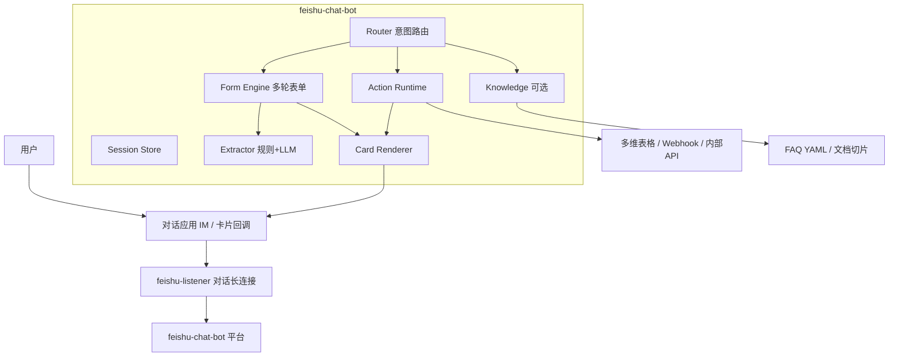

# 飞书对话机器人平台 — 长期开发规划

> 状态：规划 + 进度跟踪  
> 日期：2026-07-16（进度更新：2026-07-17）  
> 起点：现有 `feishu-bot`（原 supplier-bot；供应商多轮录入）+ `feishu-listener` 对话应用长连接  
> 目标：把「单一供应商录入服务」演进为 **YAML 驱动的飞书对话能力平台**，覆盖多类业务录入、查询、AI 回复与卡片交互，同时与 n8n 主应用权限隔离。

---

## 开发进度总览

| 阶段 | 状态 | 说明 |
| --- | --- | --- |
| Phase 0 基线 | **已完成** | 对话应用隔离、IM 长连接、供应商录入、post 插图附件 |
| Phase 1 Skill 化 | **已完成** | `config/app.yaml` + `config/skills/supplier.yaml`；Router + Form Engine 去硬编码；健康检查暴露 skills 列表 |
| Phase 1.5 边界优化 | **已完成** | 退款关键词规则、账号纯数字、选项硬提示、open_id 覆盖白名单、三字段查重、LLM 缺项/长文整理 |
| Phase 2 横向录入 | 未开始 | 客户 / 发票抬头 / 线索 / 横幅 |
| Phase 3 查询技能 | 未开始 | bitable.search |
| Phase 4 卡片 | 未开始 | 确认卡 / 菜单 / 回调 |
| Phase 5 AI 答疑 | 未开始 | FAQ / 受限问答（抽取已有） |
| Phase 6 生态衔接 | 未开始 | webhook → n8n |

**Phase 1 落地路径（代码）：**

- 配置目录：[`feishu-bot/config/`](feishu-bot/config/)
  - [`app.yaml`](feishu-bot/config/app.yaml) — 全局 TTL / 口令默认 / 路由
  - [`skills/supplier.yaml`](feishu-bot/config/skills/supplier.yaml) — 供应商技能
- 模块：`config_loader.py`、`router.py`；`dialog.py` 文案/查重/组合必填均读 skill
- 兼容：服务目录/容器名为 `feishu-bot`；改 YAML 后 `docker compose restart feishu-bot`

**Phase 1.5 边界优化（2026-07-17）：**

- `rules`：关键词命中自动设字段 + 名称 pattern（如客户退款）
- `fields.*.pattern: digits`：账号纯数字校验
- 单选/多选选项不存在 → 硬提示「联系管理员」（不再静默丢弃无声）
- `permissions.overwrite_open_ids`：仅白名单可覆盖；普通人查重命中直接拒绝
- `dedupe.fields`：供应商 / 户名 / 账号多字段 OR 查重
- `ai.extract_on_incomplete`：缺必填或长文时更积极调用 LLM 整理（确认前仍人工审）
- 运维：飞书表「类型」需含选项「客户退款」；管理员 `open_id` 填入 `app.yaml`
- **2026-07-17：** 服务目录/容器由 `supplier-bot` 更名为 `feishu-bot`（技能 id `supplier` 不变）

---

## 1. 为什么要扩展

当前 `feishu-bot` 已验证一条完整闭环：

```
用户发消息 → 对话应用 IM → listener 转发 → 抽取/多轮补全 → 确认 → 写多维表格
```

这条闭环的本质不是「供应商」，而是：

1. **意图识别**（触发词 / 自然语言）
2. **结构化采集**（字段 schema + 校验 + 附件）
3. **状态会话**（多轮、确认、取消、冲突处理）
4. **副作用执行**（写表、查重、回复）

发票抬头、横幅文案、客户档案、销售线索、活动报名……都可以复用同一套「采集 → 确认 → 落库」。  
若每个业务再写一个独立 bot，会重复造轮子；若全塞进 n8n 节点，多轮会话与卡片回调会极难维护。

因此长期方向是：**一个对话平台进程 + 多份 YAML 技能配置**，而不是 N 个硬编码服务。

---

## 2. 定位与边界

### 2.1 平台定位

| 维度 | 说明 |
| --- | --- |
| 名称（建议） | `feishu-chat-bot` / 对内仍可叫「业务助手机器人」 |
| 身份 | 继续使用 **对话专用飞书应用**（`FEISHU_CHAT_APP_*`），与 n8n 主应用隔离 |
| 入口 | 单聊为主；群聊仅 @ 或进行中会话 |
| 配置中心 | YAML（技能 / 字段 / 动作 / 卡片模板），热加载或重启加载 |
| 数据落点 | 默认多维表格；后续可扩展 webhook / 内部 API |

### 2.2 与 n8n 的分工（长期不变）

| 留在对话机器人 | 留在 n8n / 现有服务 |
| --- | --- |
| 多轮会话、缺项追问、确认 | 表变更触发的批处理、定时任务 |
| 即时问答、轻查询、卡片交互 | PDF 解析、合同生成、重 OCR、复杂审批流 |
| 「人 → 机器人」主动录入 | 「表 → 自动化」被动联动 |

原则：**对话侧负责「交互与意图」；自动化侧负责「批量与重计算」。** 两边通过多维表格或 HTTP webhook 衔接，而不是互相替代。

### 2.3 明确不做（首两年也要克制）

- 不做通用 RPA / 全企业知识库门户（先垂直业务表 + 限定语料）
- 不把主应用 bitable 事件并进对话应用
- 不在 YAML 里写任意 Python（安全与可审计性）
- 不把飞书审批流完整搬进 bot（可「发起」但不「引擎化」）

---

## 3. 需求地图（按能力分层）

### 3.1 L1 — 结构化录入（当前已有，优先横向复制）

| 业务候选 | 典型字段 | 附件/特殊点 | 与现网关系 |
| --- | --- | --- | --- |
| 供应商收款信息 | 名称、户名、账号、银行、地域、类型、结算 | 收款码附件 | **已上线** |
| 客户信息 | 客户名、联系人、电话、城市、来源、标签 | 名片图 OCR（可选） | 新表或已有客户表 |
| 线索信息 | 线索名、渠道、意向产品、跟进人、阶段 | 常需「分配」动作 | 可与客户表关联 |
| 发票抬头 | 抬头、税号、地址电话、开户行账号 | 强校验（税号格式） | 可对接开票流程 |
| 横幅 / 物料文案 | 活动名、文案、尺寸、色值、截止日期 | 设计稿附件 | 常需状态字段「待设计」 |
| 简易报销备注 | 事由、金额、日期 | 发票图（可先只存附件，识别仍走 n8n） | 与发票工作流衔接 |

**共性：** schema + 必填规则 + 确认写表。  
**差异：** 校验规则、查重键、写前/写后动作、是否允许覆盖。

### 3.2 L2 — 查询与检索

| 场景 | 用户说法 | 后端能力 |
| --- | --- | --- |
| 精确查供应商 | 「查一下德清某某的账号」 | bitable search / filter |
| 列线索 | 「我名下待跟进线索」 | 按 open_id / 人员字段过滤 |
| 业务资料问答 | 「德清茶歇结算一般几天」 | 受限语料 RAG 或 FAQ YAML |
| 订单/执行单速查 | 「某某团的执行表链接」 | 调已有表或只读 API |

查询与录入应共用 **路由器**，但动作类型不同：`action: search` vs `action: upsert_record`。

### 3.3 L3 — AI 对话增强

| 阶段 | 能力 | 风险控制 |
| --- | --- | --- |
| AI 抽取 | 已有：自由文本 → JSON 字段（规则优先） | schema 校验，确认前展示 |
| AI 补全建议 | 「还缺联系方式，要我按名片图识别吗？」 | 建议可拒绝 |
| AI 闲聊/业务答疑 | 限定 system prompt + 知识源 | 拒答清单；不编造金额账号 |
| AI 路由 | 一句「帮我记个客户」自动进 customer skill | 置信度低则反问菜单 |

AI 是 **插件**，不是状态机的替代品。状态机仍以 YAML 为准。

### 3.4 L4 — 飞书卡片交互

| 用途 | 卡片能力 | YAML 配置方向 |
| --- | --- | --- |
| 确认录入 | 字段汇总 +「确认/修改/取消」按钮 | `reply.card` 模板 |
| 选项补全 | 单选按钮组 / 下拉（卡片 2.0） | `fields[].options` → 按钮 |
| 查询结果 | 列表卡片 +「打开记录」链接 | `search.result_card` |
| 多技能入口 | 菜单卡片：「录入供应商 / 录入客户 / 查资料」 | `router.menu_card` |
| 表单卡片（远期） | 卡片内填表提交 | 需订阅卡片回调事件 |

卡片回调与 IM 消息是两条事件链，规划上要预留：

- listener 增加对话应用的 `card.action.trigger`（或等价回调）
- 平台内 `callback_id` / `skill_id` / `session_key` 绑定

---

## 4. 目标架构

### 4.1 逻辑架构



### 4.2 从录入服务到平台的演进原则

1. **先抽象技能，再改目录名**：内部可先把 supplier 配置改写成第一个 `skill`，对外服务名可暂不改。
2. **通用引擎下沉，业务只留 YAML**：`dialog.py` 中的「供应商」文案、硬编码支付规则应变为配置。
3. **动作插件化**：写表、搜索、调 n8n webhook、调 feishu-files-generation 都是 `actions`。
4. **回复通道可切换**：`text` → `card` → `card+template_id`，由 YAML 声明。

### 4.3 进程与权限

保持现有隔离：

- 主应用：bitable 事件 → n8n  
- 对话应用：IM（+ 未来卡片回调）→ chat-bot 平台  

平台内所有 Open API 继续只用 `FEISHU_CHAT_APP_*`。各 Base 需单独把对话应用加为协作者（权限最小化）。

---

## 5. YAML 配置模型（长期核心）

目标：**新增一种录入 ≈ 新增/复制一份 skill YAML，零改或极少改代码。**

### 5.1 推荐目录

```text
feishu-chat-bot/
  config/
    app.yaml                 # 全局：ttl、默认回复、菜单、AI 开关
    skills/
      supplier.yaml          # 供应商录入
      customer.yaml
      lead.yaml
      invoice_title.yaml
      banner.yaml
      faq_search.yaml        # 查询类也可当 skill
    cards/
      confirm_default.yaml   # 或内联在 skill 内
      menu.yaml
    knowledge/
      settlement_faq.yaml    # 可选
```

### 5.2 `app.yaml`（全局）

```yaml
session_ttl_minutes: 30
default_locale: zh-CN

router:
  strategy: trigger_first   # trigger_first | llm_route | menu_only
  ambiguous_reply: "请选择要办理的业务："
  menu_skill: system_menu

ai:
  enabled: true
  extract_enabled: true
  chat_enabled: false       # L3 答疑总开关
  route_enabled: false

channels:
  reply_mode: text          # text | card | auto
```

### 5.3 Skill YAML — 录入类（目标形态）

```yaml
id: supplier
name: 供应商录入
version: 1

# 路由
triggers:
  - 添加供应商
  - 录入供应商
  - /供应商
intent_examples:            # 供 LLM 路由用（可选）
  - 帮我建一个供应商
  - 登记收款信息

# 会话文案
prompts:
  start: "开始录入供应商。可一次发齐信息，或分多轮补充。"
  summary_title: "已整理供应商信息"
  confirm_hint: "请确认写入，或继续补充。"
  success: "已创建供应商「{{supplier_name}}」。"

# 口令（可继承全局，也可覆盖）
commands:
  cancel: [取消, 算了]
  confirm: [确认, 提交]
  skip: [跳过]
  overwrite: [覆盖, 更新]

# 数据源
target:
  type: bitable
  base_id: ${FEISHU_BASE_ID}
  table_id: tbl4vQ8kft1XXSLv

# 字段
fields:
  supplier_name:
    name: 供应商
    type: text
    required: true
  bank_name:
    name: 银行名称
    type: single_select
    options_from: bitable     # 启动时拉表选项；也可写死 options
  qrcode:
    name: 支付宝/微信
    type: attachment
    from: message_image

# 组合必填（替代硬编码 payment_groups）
require_any_group:
  - [account_name, account_no, bank_name]
  - [qrcode]

# 别名抽取
aliases:
  户名: account_name
  电话: contact

# 查重
dedupe:
  enabled: true
  match_field: 供应商
  on_hit: ask_overwrite       # ask_overwrite | reject | update | ignore

# 动作流水线
actions:
  on_confirm:
    - type: bitable.upsert
    - type: reply.success
  on_success:
    - type: bitable.set_field   # 可选：写「录入人」
      when: always

# 回复
reply:
  mode: text                  # 远期 card
  card_template: cards/confirm_supplier.yaml
```

### 5.4 Skill YAML — 查询类

```yaml
id: supplier_lookup
name: 查供应商
triggers: [查供应商, /查供应商]
target:
  type: bitable
  base_id: ${FEISHU_BASE_ID}
  table_id: tbl4vQ8kft1XXSLv
query:
  parse:
    - from_text: true
    - field_hints: [供应商, 账号]
  search:
    operator: contains
    limit: 5
reply:
  mode: card
  empty: "没有找到匹配的供应商。"
  item_template: |
    **{{供应商}}**
    户名：{{户名}} / 账号：{{账号}}
```

### 5.5 Skill YAML — FAQ / 资料（轻量知识）

```yaml
id: biz_faq
name: 业务资料
triggers: [结算怎么算, 怎么报销]
knowledge:
  source: file
  path: knowledge/settlement_faq.yaml
  retrieval: keyword          # keyword | embedding（远期）
ai:
  answer: true
  must_cite: true
  refuse_if_low_confidence: true
```

### 5.6 卡片配置（远期预留）

```yaml
# cards/confirm_default.yaml
type: template                # raw_json | template
template_id: ctp_xxx          # 飞书卡片搭建工具产出
variables:
  title: "{{skill.name}}确认"
  lines: "{{summary_lines}}"
actions:
  - button_id: confirm
    maps_to_command: confirm
  - button_id: cancel
    maps_to_command: cancel
```

设计要点：

- **业务人改 skill；设计人改 card 模板 ID / 变量映射**
- 卡片回调只映射到已有 `commands`，避免两套状态机
- 先支持「发卡片」，再支持「收回调」

### 5.7 配置灵活度原则

| 允许进 YAML | 不要进 YAML |
| --- | --- |
| 触发词、字段、校验、文案 | 任意脚本 / SQL |
| 动作类型与参数（白名单） | 无限 HTTP 打任意内网 |
| 卡片模板 ID 与变量 | 完整随意 JSON 逻辑分支（可用有限 when） |
| 选项列表或 `options_from: bitable` | 把密钥写进仓库 |

`when` 表达式建议限制为简单条件（字段为空、等于、组满足），用安全表达式引擎，不 `eval`。

---

## 6. 核心模块设计（实现时对照）

### 6.1 Router

输入：文本、消息类型、是否有图、当前 session。  
输出：`skill_id` 或「菜单 / 追问」。

优先级建议：

1. 已有进行中 session → 粘滞当前 skill  
2. 显式 trigger / 命令命中  
3. （可选）LLM 路由  
4. 菜单卡片 / 文本菜单  

### 6.2 Form Engine（通用化现有 dialog）

状态：`idle | collecting | confirming | await_overwrite | querying | answering`  

配置驱动：

- `required` / `suggested` / `require_any_group`
- `commands.*`
- `dedupe`
- 附件：`post` 插图 + 纯 `image`（已踩坑，平台层要一等公民支持）

### 6.3 Extractor

管道固定：`规则别名 →（可选）LLM JSON → select 归一 → 业务校验器`。  
校验器可插拔：`tax_id`、`bank_account`、`phone`、`url`。

### 6.4 Action Runtime

白名单动作示例：

| type | 用途 |
| --- | --- |
| `bitable.create` / `upsert` / `search` | 表读写 |
| `reply.text` / `reply.card` | 回复 |
| `http.webhook` | 通知 n8n（录入成功后触发后续流） |
| `knowledge.search` | FAQ |
| `ai.chat` | 受限问答 |

每个动作声明超时、重试、失败是否回滚会话。

### 6.5 Session Store

继续 SQLite 即可；键：`open_id` 或 `open_id+chat_id`。  
payload 存：`skill_id`、`state`、`data`、`dedupe_record_id`、`last_card_message_id`。

---

## 7. 分阶段路线图

### Phase 0 — 固化现状（已完成基线）

- [x] 对话应用隔离、IM 长连接、供应商录入、post 插图附件  
- [x] 文档：feishu-bot README / 本规划  

### Phase 1 — Skill 化重构（平台地基） — **已完成（2026-07-16）**

**目标：** 供应商变为第一个 skill；引擎不再出现「供应商」硬编码。

交付：

- [x] `config/skills/supplier.yaml` 等价迁移现网行为  
- [x] Form Engine（`dialog.py`）+ Router（`router.py`，trigger + session 粘滞）  
- [x] 启动加载校验（缺 skills / table_id / fields 则 fail）  
- [x] 回归：单元测试覆盖抽取 / 校验 / 对话 / 路由  

**验收：** 不改代码，只改 YAML 能调整触发词/必填/文案/查重策略。  
**备注：** 银行简称模糊匹配仍在 `validator.py` 代码内；选项列表与文案已全部 YAML 化。服务目录已更名为 `feishu-bot`（原 `supplier-bot`）。

### Phase 2 — 横向录入扩 skill

优先顺序建议：

1. **客户信息**（字段清晰、复用性强）  
2. **发票抬头**（校验价值高）  
3. **线索**（含简单「跟进人=当前用户」）  
4. **横幅/物料**（附件多）  

每加一个 skill：复制 YAML → 改 table/fields → 加权限协作者 → 冒烟。

**验收：** 新增录入类业务 ≤ 0.5 天（不含飞书表设计）。

### Phase 3 — 查询技能

- `bitable.search` + 文本/简易卡片结果  
- 「查供应商 / 查客户」  
- 与录入 skill 共享字段别名  

### Phase 4 — 卡片确认与菜单

- 确认卡片（按钮 = confirm/cancel）  
- 启动菜单卡片  
- listener 订阅卡片回调并路由到同一 Session  

**验收：** 手机端可只点按钮完成确认，少打字。

### Phase 5 — AI 答疑与资料检索

- FAQ YAML / 精选文档切片  
- `ai.chat` 开关默认关，按 skill 开启  
- 安全：账号、金额、身份证等敏感字段拒答或仅查表展示  

### Phase 6 — 生态衔接

- 录入成功 `http.webhook` → n8n（例如线索创建后建跟进任务）  
- 只读调用现有服务（合同/出团）返回链接，不把重逻辑搬进 bot  
- （可选）管理端：YAML 在线编辑与发布（仍需评审）  

---

## 8. 需求优先级建议（产品视角）

| 优先级 | 项 | 理由 |
| --- | --- | --- |
| P0 | Skill 化 + 再加 1～2 个录入 | 放大已验证闭环 |
| P1 | 查询供应商/客户 | 录入后的刚需，降低找表成本 |
| P1 | 确认卡片 | 显著提升移动端体验 |
| P2 | 菜单 / LLM 路由 | 技能变多后的发现性 |
| P2 | 发票抬头等强校验录入 | 减少脏数据 |
| P3 | AI 业务答疑 | 价值高但治理成本高 |
| P3 | 卡片内表单 | 依赖回调与卡片 2.0 能力，排后 |

---

## 9. 风险与治理

| 风险 | 缓解 |
| --- | --- |
| YAML 膨胀难维护 | skill 单文件；公共片段 `anchors` / `extends`；启动 schema 校验 |
| LLM 写错关键字段 | 确认步强制展示；账号类规则二次校验；高风险字段禁止仅靠 LLM |
| 权限过大 | 对话应用按 Base 授权；查询 skill 默认只读权限应用（远期可双身份，初期严格评审） |
| 与 n8n 重复建设 | 新需求先问：是否多轮交互？否 → n8n；是 → bot skill |
| 卡片回调超时 | 3s 内 ACK + 异步更新；会话幂等 |
| 群聊噪音 | 默认仅 p2p；群必须 @ |
| 配置误发布 | 配置 PR 审查；`dispatch_enabled` 式 skill 开关 |

---

## 10. 成功度量

- **配置效率：** 新增录入 skill 不改代码的比例  
- **完成率：** 触发录入后成功写表的会话占比  
- **轮次：** 平均完成轮次（卡片上线后应下降）  
- **差错：** 写表后人工修正率（字段抽错）  
- **隔离：** 对话故障不影响 n8n bitable 路由（进程/应用双隔离）  

---

## 11. 近期决策（建议拍板）

在动手 Phase 1 前，建议确认：

1. **服务演进方式：** 已原地将 `supplier-bot` 更名为 `feishu-bot` 并作为平台进程演进。  
2. **下一个录入业务：** 客户 vs 发票抬头 vs 线索（推荐：**客户信息**）。  
3. **卡片时间点：** Phase 2 之后再上确认卡片，还是与第二个 skill 并行（推荐：**第二个 skill 稳定后再上卡片**）。  
4. **AI 答疑范围：** 先不做，或仅 FAQ 关键词（推荐：**Phase 5 再开，Phase 1–2 只用 AI 抽取**）。  

---

## 12. 附录：与现状代码的映射

| 现有模块 | 平台中的归宿 |
| --- | --- |
| `feishu-bot/dialog.py` | Form Engine（去业务硬编码） |
| `extractor.py` / `validator.py` | 保留并泛化为字段类型插件 |
| `feishu_client.py` | 平台 SDK（IM/表/媒体/卡片） |
| `session_store.py` | 通用 Session（增加 skill_id） |
| `config.yaml` | `skills/supplier.yaml` + `app.yaml` |
| `feishu-listener` IM + `chat_ws.py` | 继续作为唯一事件入口；远期加卡片回调 |
| n8n 工作流 | 通过 webhook action 衔接，不接管会话 |

---

## 13. 一句话结论

**把机器人从「供应商录入工具」升级为「YAML 技能平台」：交互与会话留在对话应用，重自动化留在 n8n；用 skill 配置横向扩展录入/查询，用卡片与 AI 纵向提升体验，按 Phase 1→6 演进，避免过早做成万能 Agent。**

本文档只定方向与配置形态；确认优先级后，再单独立项输出 Phase 1 的实现计划与接口草案。
